<!-- AUTO-GENERATED by scripts/convert.py — do not edit. -->

The lecturer opened with an extended administrative segment --- syllabus,
homework conventions, the relationship between FINM 37400 (the first half) and
FINM 37500 (the second half on derivatives), TA introductions --- and emphasized
that the two halves are run as one continuous course with the first treated as
a strict prerequisite for the second. About thirty minutes in, after walking
through the published course site at `markhendricks.github.io/finm-fixedincome`,
he opened the first content notebook --- *1.1. The Spot Discount Curve* ---
and began the substantive material that occupies the rest of these notes. A
short final segment previewed the Expectations Hypothesis (notebook 1.3), which
is properly the territory of Lecture 2 and is not reproduced here.

# The Spot Discount Curve {#L1-sec:spot}

## The Spot Curve and No-Arbitrage {#L1-sec:spot-noarb}

:::{.callout-important title="Key concept"}

**Cell 1.** *(Page 1.1 · setup)*\
The notebook opens with the standard scientific-Python setup,
loads the day's Treasury quote file, and renames the simplified columns
(`quote date`, `cpn rate`, `dirty price`, ...) onto
the CRSP-style names (`CALDT`, `TCOUPRT`, `TDNOMPRC`,
...) that the existing `cmds.treasury_cmds` helpers expect.
The first non-trivial output is the head of the loaded quote frame:

::: center


```{=html}
<div class="table-scroll">
<table border="1" class="dataframe">
<thead>
<tr style="text-align: right;">
<th></th>
<th>type</th>
<th>quote date</th>
<th>issue date</th>
<th>maturity date</th>
<th>ttm</th>
<th>accrual fraction</th>
<th>cpn rate</th>
<th>bid</th>
<th>ask</th>
<th>clean price</th>
<th>accrued int</th>
<th>price</th>
<th>ytm</th>
<th>total size</th>
</tr>
<tr>
<th>KYTREASNO</th>
<th></th>
<th></th>
<th></th>
<th></th>
<th></th>
<th></th>
<th></th>
<th></th>
<th></th>
<th></th>
<th></th>
<th></th>
<th></th>
<th></th>
</tr>
</thead>
<tbody>
<tr>
<th>204083</th>
<td>bond</td>
<td>2024-04-30</td>
<td>1994-05-15</td>
<td>2024-11-15</td>
<td>0.544832</td>
<td>0.917582</td>
<td>7.500</td>
<td>101.289062</td>
<td>101.320312</td>
<td>101.304688</td>
<td>3.440934</td>
<td>104.745622</td>
<td>0.049859</td>
<td>9.604000e+09</td>
</tr>
<tr>
<th>204084</th>
<td>bond</td>
<td>2024-04-30</td>
<td>1995-02-15</td>
<td>2025-02-15</td>
<td>0.796715</td>
<td>0.412088</td>
<td>7.625</td>
<td>102.070312</td>
<td>102.101562</td>
<td>102.085938</td>
<td>1.571085</td>
<td>103.657023</td>
<td>0.048830</td>
<td>9.509000e+09</td>
</tr>
<tr>
<th>204085</th>
<td>bond</td>
<td>2024-04-30</td>
<td>1995-08-15</td>
<td>2025-08-15</td>
<td>1.292266</td>
<td>0.412088</td>
<td>6.875</td>
<td>102.484375</td>
<td>102.515625</td>
<td>102.500000</td>
<td>1.416552</td>
<td>103.916552</td>
<td>0.048563</td>
<td>1.118700e+10</td>
</tr>
<tr>
<th>204086</th>
<td>bond</td>
<td>2024-04-30</td>
<td>1996-02-15</td>
<td>2026-02-15</td>
<td>1.796030</td>
<td>0.412088</td>
<td>6.000</td>
<td>101.851562</td>
<td>101.882812</td>
<td>101.867188</td>
<td>1.236264</td>
<td>103.103451</td>
<td>0.048895</td>
<td>1.283800e+10</td>
</tr>
<tr>
<th>204087</th>
<td>bond</td>
<td>2024-04-30</td>
<td>1996-08-15</td>
<td>2026-08-15</td>
<td>2.291581</td>
<td>0.412088</td>
<td>6.750</td>
<td>103.726562</td>
<td>103.757812</td>
<td>103.742188</td>
<td>1.390797</td>
<td>105.132984</td>
<td>0.050032</td>
<td>8.810000e+09</td>
</tr>
</tbody>
</table>
</div>
```

{width="90%" height="80%"}
:::

The screenshot crops the right-hand columns (`ytm`, `accrued int`, `total size`); for the full table see the live page at
`discussions/1.1. The Spot Discount Curve.html`, top-of-page
preamble, the cell that calls `metrics.head()`.

:::

The lecturer used this opening to remind the class that the data file is one
day's worth of CRSP-style Treasury quotes --- bills, notes, bonds, and TIPS
--- with quote prices already split into *clean* and *dirty*
(accrued-interest-inclusive) columns. He stressed that throughout the course
"price" will mean the dirty price, the actual transactable cash amount,
because no-arbitrage statements only hold on dirty prices: a clean price
ignores accrued interest, and a clean-price equality between two cashflow-equivalent
bonds would be off by exactly the accrued-interest discrepancy.

:::{.callout-important title="Key concept"}

**Cell 4--9.** *The Spot Curve and No-Arbitrage.*\
**Above we saw that:**

- YTM is an alternate way to quote a price.

- For a zero-coupon bond held to maturity, it is the annualized return.

- Beyond that, YTM is not useful.

- In particular, YTM is not useful for pricing other securities.

YTM assigns a discount rate to the security (across all its cashflows). We
seek a discount rate that fits a particular maturity --- a function of time
to maturity, not of the bond.

**No arbitrage.** No-arbitrage conditions say that two risk-free cashflows
occurring at the same time must have the same price.

:::

The lecturer used the YTM-is-not-useful-beyond-its-own-bond argument as the
entry point to the entire term-structure project. His framing: yield-to-maturity
is a single number that, when used to discount *all* of a bond's cashflows,
reproduces its market price. That makes YTM a perfectly valid summary of the
bond, but a terrible discount rate for any *other* cashflow. If you took
the 5-year bond's YTM and tried to discount a one-year cashflow with it, you
would generally get a price that disagrees with the one-year bill's actual
quote --- and the difference, the lecturer warned, is exactly an arbitrage
opportunity if you treat YTM as a true discount rate.

The way out is to demand a discount rate that depends only on *when* the
cashflow lands, not on which bond it came from. That is the spot rate $r(t,T)$:
the rate, observed at $t$, that prices a single risk-free dollar paid at $T$.
Because spot rates do not depend on the originating bond, they automatically
satisfy the no-arbitrage statement above --- two bonds with the same cashflow
schedule, discounted with the same spot rates, must price to the same number.

:::{.callout-tip title="Filling the gap"}

**Filling the gap.** The lecturer said "YTM assigns a discount rate to
the security across all its cashflows" as if it were obvious. To unpack: for
a coupon bond $j$ with cashflows $c/2$ at semiannual dates $T_1,\dots,T_n$ and
final principal $100$ at $T_n$, the YTM $y_j$ is defined implicitly by
$$P_j(t,T,c) \;=\; \sum_{i=1}^{n} \frac{c/2}{(1+y_j/2)^{2(T_i - t)}}
                     \;+\; \frac{100}{(1+y_j/2)^{2(T_n-t)}}.$$
The same $y_j$ discounts *every* cashflow. If two bonds with different
coupon schedules trade at the same time, they will generally have different
YTMs, even though no-arbitrage demands a *single* rate per maturity. That
contradiction is precisely the symptom that YTM is not the right object for
cross-bond pricing.

:::

## The Spot Curve {#L1-sec:spot-curve}

:::{.callout-important title="Key concept"}

**Cells 11--19.** *The Spot Curve definition.*\
We seek a spot curve of discount rates $r(t,T)$ such that we can price
cashflows as
$$P_j(t,T,c) \;=\; \sum_{i=1}^{n}\frac{c_{j,i}}{e^{r(t,T_i)\,(T_i-t)}}
                     \;+\; \frac{100}{e^{r(t,T_n)\,(T_n-t)}}.$$
Notice that this equation differs from the YTM definitional equation. The spot
rate $r(t,T_i)$ *does not* depend on the specific bond $j$; it is a
function of the cashflow timing $T_i$ alone.

**Reminder: YTM Formula.** Define the yield-to-maturity for bond $j$ as
the term $y_j$ which satisfies
$$P_j(t,T,c) \;=\; \sum_{i=1}^{n} \frac{c_{j,i}}{(1+y_j/2)^{2(T_i-t)}}
                     \;+\; \frac{100}{(1+y_j/2)^{2(T_n-t)}}.$$

:::

The lecturer was emphatic about the structural difference between these two
equations even though they look superficially similar. The YTM equation has
*one* unknown per bond ($y_j$) and is solved bond-by-bond. The spot-curve
equation has *many* unknowns ($r(t,T_i)$ for every cashflow date appearing
across the universe of bonds), but those unknowns are shared across all bonds:
the one-year spot rate that prices a coupon paid by a 30-year bond is the same
one-year spot rate that prices the principal of a one-year bill. That sharing
is what turns a flat YTM curve into the structured estimation problem of the
rest of the lecture.

He also paused to write the continuous-compounding form of the spot equation
on the board, since the slide as printed uses different notation in different
places. Throughout the course we will write the discount as either
$e^{-r(t,T)(T-t)}$ (continuous) or as $(1+r_n/n)^{-n(T-t)}$ for a stated
compounding frequency $n$. The mapping between them is a one-line algebraic
exercise that we revisit below.

## The Discount Curve {#L1-sec:disc-curve}

:::{.callout-important title="Key concept"}

**Cells 20--24.** *The Discount Curve and compounding.*\
**Discount Factor vs Compounded Rates.** All compounded rates imply the
same discount when the compounding frequency is accounted for:
$$\text{discount} \;\equiv\; Z(t,T)
       \;=\; \frac{1}{\bigl(1 + r_n/n\bigr)^{n(T-t)}}
       \;=\; e^{-r(T-t)}.$$
The discount factors are uniquely determined and can be converted to a spot
curve of any compounding frequency.

:::

This was the slide the lecturer pulled up around the 49-minute mark, and it
became the conceptual anchor for the rest of the spot-curve material. His
point: the *discount factor* $Z(t,T)$ is the primitive object. It does
not depend on a compounding convention --- it is just the number you multiply
by today's dollar to get the future-dated dollar's value. The spot rate
$r(t,T)$ is a derived object: any choice of compounding frequency $n$ produces
a different rate that nonetheless implies the same $Z$. He said it twice in
slightly different words, because students new to fixed income often try to
"correct" a rate from one convention to another by multiplying or dividing
by something --- the right operation is always to drop down to $Z$ and come
back up at the new convention.

He then made an aside that recurs throughout the course: *multiplicative
pricing* is the natural language of $Z$. To value a stream of risk-free
cashflows $c_1,\dots,c_n$ at dates $T_1,\dots,T_n$, you compute
$\sum_i c_i\, Z(t,T_i)$. There is no rate-arithmetic involved. Whenever a
calculation gets tangled in compounding, the recommended sanity check is to
re-do it with $Z$.

:::{.callout-important title="Key concept"}

**Cells 25--27.** *Example.*\
Consider the annually compounded spot rate of 5% at maturity $T-t=1$.

::: center
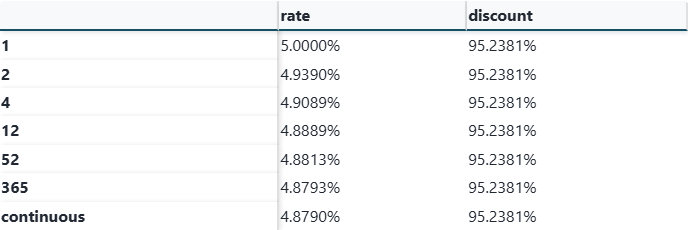{width="90%" height="80%"}
:::

The table shows the equivalent rate at each compounding frequency
(5.0000%, 4.9390%, 4.9089%, 4.8889%, 4.8813%, 4.8793%, 4.8790%) and a
common discount of 95.2381%. The point is the right column: every row gives
the same discount factor.

:::

The lecturer pointed at the `discount` column and asked the class
whether they were surprised to see all 95.2381%. Some were. The exercise
exists, he said, to drive home that the rate is a *label* for a discount,
nothing more. The continuous row at 4.8790% is the natural limit and is the
convention we will default to for spot rates later.

## The Curve {#L1-sec:curve}

:::{.callout-important title="Key concept"}

**Cells 28--32.** *The Curve.*\
Denote the discount curve as $Z(t,T)$. This value depends on the maturity. It
is not compounded. Any compounded spot rate will lead to it.

The discount curve is useful for multiplicative pricing.

**Zero coupon bond:**
$$P_j(t,T) \;=\; Z(t,T) \times 100.$$

:::

The lecturer drew $Z(\cdot)$ on the whiteboard as a smooth, downward-sloping
curve in $T$, anchored at $Z(t,t)=1$ and approaching zero for very long
maturities under any positive rate environment. He warned that empirically,
$Z(t,T)$ at the very short end is essentially $1$ minus a small positive
number (today's overnight rate times the tiny horizon), and at the long end
hovers in the $0.3$--$0.6$ range for a 30-year discount, depending on the
prevailing level of long rates. Anything outside that ballpark for a Treasury
discount factor should make you suspect a data error.

## Coupon Bonds and the Modeling Pipeline {#L1-sec:coupon}

:::{.callout-important title="Key concept"}

**Cells 33--34.** *Coupon bond.*\
**Use.** If we estimate the discount curve (equivalent to estimating the
spot curve), then we can price the coupon bond as
$$P_j(t,T,c) \;=\; \frac{c}{2}\sum_{i=1}^{n} Z(t,T_i)
                     \;+\; 100\, Z(t,T_n).$$

:::

This is the central pricing identity of the lecture. Once $Z$ is known at
every cashflow date in the bond's schedule, the price is a single dot product
of the cashflow vector and the discount vector. The lecturer paused here to
say that almost every estimation difficulty in the rest of the day arises from
this innocuous-looking equation: we have many bonds, each with its own
cashflow schedule, all sharing the same underlying $Z(\cdot)$. Estimating $Z$
from observed bond prices is therefore a system of equations whose
identifiability is far from automatic.

## Modeling the Spot Curve --- Filtering and Cashflow Mapping {#L1-sec:filter-map}

:::{.callout-important title="Key concept"}

**Cells 35--36.** *Modeling the Spot Curve.*\
**Filter Data.** Filter to eliminate maturities that are too short or
too long, quotes that do not have transparent pricing, and so on.

:::

:::{.callout-important title="Key concept"}

**Cells 37--38.** *Map Cashflows.*

::: center
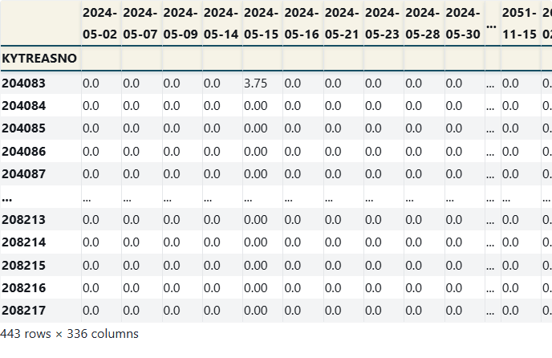{width="90%" height="80%"}
:::

The output of `calc_cashflows` is the cashflow matrix $\mathbf{C}$:
each row is a Treasury issue, each column is a calendar date, each entry is
the cash paid on a (normalized) face of \$100. The screenshot crops the
right-hand columns; for the full matrix scroll the live page at
`discussions/1.1. The Spot Discount Curve.html`, section
*Map Cashflows*.

:::

The lecturer described the matrix $\mathbf{C}$ in plain words on the
whiteboard: "security on the row, calendar date on the column." For the
April 30, 2024 quote file, that produces a matrix with hundreds of rows
(every outstanding nominal Treasury) and a column for every distinct cashflow
date over the next 30 years. Most of the matrix is zero --- a given bond pays
on at most $\sim 60$ dates --- and the columns themselves are clustered around
the canonical mid-month and end-month coupon dates.

He then walked through the filter choices and was emphatic that the choices
matter for what comes next:

- **Yield filter.** Drop bonds with implausible quoted yields
  (negative, or wildly off the visible cluster). These are usually
  stale quotes or special-issue bonds.

- **TIPS filter.** Drop TIPS. They are inflation-linked and would
  be an apples-to-oranges comparison with the nominal curve we are
  building.

- **Maturity filter.** Drop the very short end (where a single
  bill near maturity has wild quote noise) and bonds beyond a chosen
  horizon.

- **Date-uniqueness restrictions.** Two restrictions become important
  for the bootstrap below: `RESTRICT_DTS_MATURING` requires at
  least one (and at most one) bond maturing on each date in scope, and
  `RESTRICT_REDUNDANT` drops bonds whose cashflow rows are
  linearly dependent on others already in the system.

## Estimating the Discounts {#L1-sec:estimate}

:::{.callout-important title="Key concept"}

**Cells 39--42.** *Estimating the discounts.*\
Notation:

- $\boldsymbol{p}$: $n\times 1$ vector of the price for each issue.

- $\boldsymbol{z}$: $k\times 1$ vector of the discount factors for each
  relevant date (one per cashflow column of $\mathbf{C}$).

- $\boldsymbol{C}$: $n\times k$ cashflow matrix.

The pricing identity is
$$\boldsymbol{p} \;=\; \boldsymbol{C}\,\boldsymbol{z}.$$
If we allow for estimation error and small market frictions:
$$\boldsymbol{p} \;=\; \boldsymbol{C}\,\boldsymbol{z} \;+\; \boldsymbol{\epsilon}.$$

:::

This is the slide visible in frame 70 around the 1:09 mark. The lecturer drew
the matrix on the board as a tall thin sketch, labeled the dimensions, and
underlined the question that drives the next several subsections: *what
shape is $\mathbf{C}$, and what does that imply for solving for $\boldsymbol{z}$?*
He stressed that the equation $\boldsymbol{p}=\boldsymbol{C}\boldsymbol{z}$ is
*not* an econometric model in the regression-with-noise sense; it is a
mechanical pricing identity that holds exactly under no-arbitrage. The
$\boldsymbol{\epsilon}$ term is a concession to the practical reality that
quotes are noisy --- bid-ask spreads, stale prints, occasional special tax
treatment --- not a statement about a true data-generating process.

:::{.callout-important title="Key concept"}

**Cells 43--45.** *Which estimation?*\
What if $\mathbf{C}$ is square, $n=k$; tall, $n>k$; wide, $k>n$?

**Identified.** Suppose $\mathbf{C}$ is linearly independent. Then we can
solve uniquely for $\boldsymbol{z}$.

**Unidentified.** The discount curve is not identified --- think
pseudoinverse, LASSO, regularization.

:::

The lecturer fielded a class question on dimension reduction here. His answer:
in this domain we essentially never use LASSO or pseudoinverse-style
identification fixes; the right move is to impose *structure on the
curve*, which is the Nelson--Siegel content below. He framed the trichotomy
as: square ($n=k$, exactly identified) is the bootstrap; tall ($n>k$, more
bonds than dates) is OLS; wide ($k>n$, more dates than bonds) is unidentified
in the unrestricted form and is what motivates a parametric model.

## Perfect Estimation: Bootstrap and OLS {#L1-sec:perfect}

:::{.callout-important title="Key concept"}

**Cells 46--50.** *Perfect Estimation of Spot Curve.*\
**Bootstrap.**

::: center
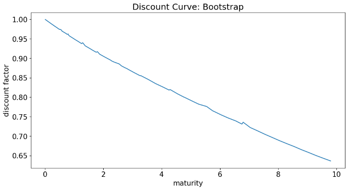{width="90%" height="80%"}
:::

**OLS Estimation.** Same restrictions, model swapped for OLS.

::: center
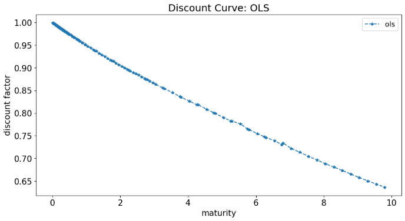{width="90%" height="80%"}
:::

:::

The lecturer skipped what he called "the tedium of the bootstrap story" but
the mechanics are worth recording in writing because they are easy to misread:

:::{.callout-tip title="Filling the gap"}

**Filling the gap.** The bootstrap is the iterative procedure that solves
the system one date at a time, starting from the shortest maturity:

1.  Take the bond with the earliest maturity $T_1$. Its only cashflow is
    the final principal-plus-coupon, so the price gives $Z(t,T_1)$
    directly: $P_1 = (\text{cf})\, Z(t,T_1)$.

2.  Take the bond with the next earliest maturity $T_2$. Its cashflows are
    a coupon at $T_1$ (already discounted with the now-known $Z(t,T_1)$)
    plus the final principal-plus-coupon at $T_2$. The single unknown
    $Z(t,T_2)$ is solved by subtraction.

3.  Continue forward in maturity, at each step using all already-known
    $Z(t,T_i)$ to back out the new $Z(t,T_j)$.

The procedure requires *exactly one* bond maturing at each $T_j$ in scope
--- which is what the `RESTRICT_DTS_MATURING` flag enforces --- and
breaks if any cashflow column is shared across multiple bonds. OLS, by
contrast, is the global least-squares solution
$\hat{\boldsymbol{z}} = (\mathbf{C}^\top\mathbf{C})^{-1}\mathbf{C}^\top\boldsymbol{p}$
and is well-defined whenever $\mathbf{C}$ has full column rank.

:::

## Spot Curve Output {#L1-sec:spot-output}

:::{.callout-important title="Key concept"}

**Cells 51--55.** *Spot Curve.*\
The spot curve of interest rates can be calculated for any compounding
frequency. The figure below plots it for continuous compounding.

::: center
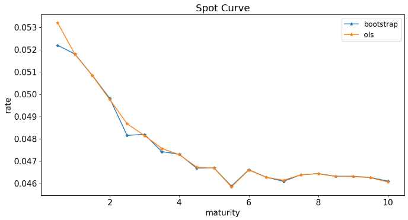{width="90%" height="80%"}
:::

The estimated spot curves under bootstrap and OLS are nearly identical when
the date-uniqueness restrictions are imposed.

:::

## Why not Bootstrap the Entire Curve? {#L1-sec:why-not}

:::{.callout-important title="Key concept"}

**Cells 56--71.** *Why not bootstrap the entire curve?*\
We have quotes with maturities out to nearly 30 years. We restricted the
bootstrap and OLS estimates to a sample with at least one (and for the
bootstrap, exactly one) Treasury maturing on each cashflow date. Why not
include all the sample data?

The notebook re-runs the estimation after setting
`RESTRICT_DTS_MATURING = False` and
`RESTRICT_REDUNDANT = False` (see the live page at
`discussions/1.1. The Spot Discount Curve.html`, section
*Why not bootstrap the entire curve?*, the two cells immediately
under that heading). The first plot below is the resulting OLS discount
curve under the relaxed restrictions:

::: center
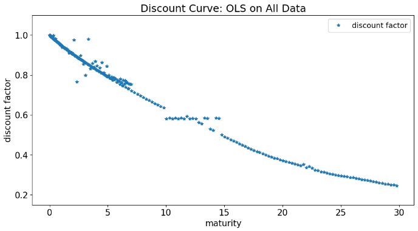{width="90%" height="80%"}
:::

The OLS-extracted discount curve under the relaxed restrictions
*vacillates extremely* in the first 5 years and is seemingly missing
discounts between 10 and 15 years.

::: center
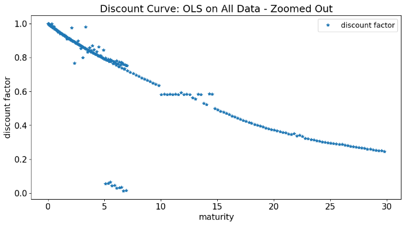{width="90%" height="80%"}
:::

::: center
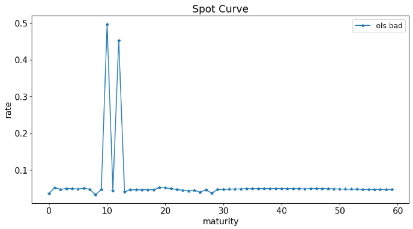{width="90%" height="80%"}
:::

In fact, it is worse than it appears: the missing values in years 10--15 are
not missing --- they are huge positive and negative numbers that the plot
clipped.

:::

This was the demonstration the lecturer used to motivate parametric models.
He pulled up the unrestricted-OLS plot and pointed at the wild oscillation
in the first 5 years and the clipped region in years 10--15, telling the
class: "I'm not showing you that this is a bad implementation. This is what
*ordinary least squares* gives you when you feed it the full quote
file." His phrasing: *the non-smoothness here is absurd*, and what
absurd looks like in this picture is the sign that something fundamental about
the problem --- not the algorithm --- is wrong. That "something fundamental"
is multicollinearity in $\mathbf{C}$, the topic of the next subsection.

## Multicollinearity {#L1-sec:multicol}

:::{.callout-important title="Key concept"}

**Cells 72--78.** *Multicollinearity.*\
The problem with using the bootstrap (or more generally, OLS) is
multicollinearity in the cashflow matrix.

Recall that perfect (mathematical) multicollinearity implies that the
parameters of the system are not uniquely identified. In the empirical
setting, near-multicollinearity means small perturbations to the data produce
huge swings in the estimated parameters.

Consider the condition number of the cashflow matrix:

::: center


```{=html}
<div class="table-scroll">
<table id="T_74a66">
<thead>
<tr>
<th class="blank level0"> </th>
<th class="col_heading level0 col0" id="T_74a66_level0_col0">cashflow matrix condition number</th>
</tr>
<tr>
<th class="index_name level0">data set</th>
<th class="blank col0"> </th>
</tr>
</thead>
<tbody>
<tr>
<th class="row_heading level0 row0" id="T_74a66_level0_row0">single maturity per date, no non-maturity dates</th>
<td class="data row0 col0" id="T_74a66_row0_col0">1.55e+00</td>
</tr>
<tr>
<th class="row_heading level0 row1" id="T_74a66_level0_row1">no non-maturity dates</th>
<td class="data row1 col0" id="T_74a66_row1_col0">3.60e+00</td>
</tr>
<tr>
<th class="row_heading level0 row2" id="T_74a66_level0_row2">all dates</th>
<td class="data row2 col0" id="T_74a66_row2_col0">1.54e+18</td>
</tr>
<tr>
<th class="row_heading level0 row3" id="T_74a66_level0_row3">all dates, including negative YTM quotes</th>
<td class="data row3 col0" id="T_74a66_row3_col0">1.68e+18</td>
</tr>
</tbody>
</table>
</div>
```

{width="90%" height="80%"}
:::

The condition number gives an idea of how a small perturbation to the data
would impact the solution. It is closely related to the determinant.

:::

The lecturer dwelt on this slide for several minutes. His point: when you
have multiple bonds with cashflows on the same dates --- which is the
generic case once you let the full quote file in --- the rows of $\mathbf{C}$
become nearly linearly dependent. The matrix $\mathbf{C}^\top\mathbf{C}$ is
then ill-conditioned, and inverting it amplifies pricing noise into wild
swings in the estimated $\boldsymbol{z}$. The visible result is the previous
plot: discount factors that swing through tens of percentage points between
adjacent maturities, even producing negative-or-greater-than-one discount
factors that cannot be true.

:::{.callout-tip title="Filling the gap"}

**Filling the gap.** The lecturer mentioned "$x'x$" in passing but did
not write out the connection. The standard expression
$\hat{\boldsymbol{z}} = (\mathbf{C}^\top\mathbf{C})^{-1}\mathbf{C}^\top\boldsymbol{p}$
makes the problem explicit: if the eigenvalues of $\mathbf{C}^\top\mathbf{C}$
span many orders of magnitude (large condition number), then
$(\mathbf{C}^\top\mathbf{C})^{-1}$ has eigenvalues spanning the reciprocal
range, and any noise in $\mathbf{p}$ aligned with the small-eigenvalue
direction of $\mathbf{C}^\top\mathbf{C}$ gets amplified by the corresponding
large eigenvalue of the inverse. That is exactly the symptom we see: small
quote-level noise becomes large discount-factor swings.

:::

## Nelson--Siegel Model of the Yield Curve {#L1-sec:NS}

:::{.callout-important title="Key concept"}

**Cells 79--92.** *Nelson--Siegel.*\
We need a model for the curve to avoid missing data and overfitting in-sample.
The most famous such model is Nelson--Siegel, which models the spot curve as
a smooth function of maturity with 4 parameters (or 6, in the extended
"Nelson--Siegel--Svensson" version):
$$r(t,T) \;=\; f(T-t,\boldsymbol{\theta})
            \;=\; \theta_0
                  + (\theta_1 + \theta_2)\,
                    \frac{1 - e^{-\tau/\theta_3}}{\tau/\theta_3}
                  - \theta_2\, e^{-\tau/\theta_3},$$
where $\tau = T-t$ and $\boldsymbol{\theta}=(\theta_0,\theta_1,\theta_2,\theta_3)$.

For any set of parameters, the model produces a smooth spot curve at every
maturity, including those with no observed bond. The Nelson--Siegel model is
estimated by searching over $\boldsymbol{\theta}$ to minimize the sum of
squared pricing errors:

::: center


```{=html}
<div class="table-scroll">
<table border="1" class="dataframe">
<thead>
<tr style="text-align: right;">
<th></th>
<th>2024-05-02</th>
<th>2024-05-07</th>
<th>2024-05-09</th>
<th>2024-05-14</th>
<th>2024-05-15</th>
<th>2024-05-16</th>
<th>2024-05-21</th>
<th>2024-05-23</th>
<th>2024-05-28</th>
<th>2024-05-30</th>
<th>...</th>
<th>2051-11-15</th>
<th>2052-02-15</th>
<th>2052-05-15</th>
<th>2052-08-15</th>
<th>2052-11-15</th>
<th>2053-02-15</th>
<th>2053-05-15</th>
<th>2053-08-15</th>
<th>2053-11-15</th>
<th>2054-02-15</th>
</tr>
<tr>
<th>KYTREASNO</th>
<th></th>
<th></th>
<th></th>
<th></th>
<th></th>
<th></th>
<th></th>
<th></th>
<th></th>
<th></th>
<th></th>
<th></th>
<th></th>
<th></th>
<th></th>
<th></th>
<th></th>
<th></th>
<th></th>
<th></th>
<th></th>
</tr>
</thead>
<tbody>
<tr>
<th>204083</th>
<td>0.0</td>
<td>0.0</td>
<td>0.0</td>
<td>0.0</td>
<td>3.75</td>
<td>0.0</td>
<td>0.0</td>
<td>0.0</td>
<td>0.0</td>
<td>0.0</td>
<td>...</td>
<td>0.0</td>
<td>0.0</td>
<td>0.0</td>
<td>0.0</td>
<td>0.0</td>
<td>0.0</td>
<td>0.0</td>
<td>0.0</td>
<td>0.0</td>
<td>0.0</td>
</tr>
<tr>
<th>204084</th>
<td>0.0</td>
<td>0.0</td>
<td>0.0</td>
<td>0.0</td>
<td>0.00</td>
<td>0.0</td>
<td>0.0</td>
<td>0.0</td>
<td>0.0</td>
<td>0.0</td>
<td>...</td>
<td>0.0</td>
<td>0.0</td>
<td>0.0</td>
<td>0.0</td>
<td>0.0</td>
<td>0.0</td>
<td>0.0</td>
<td>0.0</td>
<td>0.0</td>
<td>0.0</td>
</tr>
<tr>
<th>204085</th>
<td>0.0</td>
<td>0.0</td>
<td>0.0</td>
<td>0.0</td>
<td>0.00</td>
<td>0.0</td>
<td>0.0</td>
<td>0.0</td>
<td>0.0</td>
<td>0.0</td>
<td>...</td>
<td>0.0</td>
<td>0.0</td>
<td>0.0</td>
<td>0.0</td>
<td>0.0</td>
<td>0.0</td>
<td>0.0</td>
<td>0.0</td>
<td>0.0</td>
<td>0.0</td>
</tr>
<tr>
<th>204086</th>
<td>0.0</td>
<td>0.0</td>
<td>0.0</td>
<td>0.0</td>
<td>0.00</td>
<td>0.0</td>
<td>0.0</td>
<td>0.0</td>
<td>0.0</td>
<td>0.0</td>
<td>...</td>
<td>0.0</td>
<td>0.0</td>
<td>0.0</td>
<td>0.0</td>
<td>0.0</td>
<td>0.0</td>
<td>0.0</td>
<td>0.0</td>
<td>0.0</td>
<td>0.0</td>
</tr>
<tr>
<th>204087</th>
<td>0.0</td>
<td>0.0</td>
<td>0.0</td>
<td>0.0</td>
<td>0.00</td>
<td>0.0</td>
<td>0.0</td>
<td>0.0</td>
<td>0.0</td>
<td>0.0</td>
<td>...</td>
<td>0.0</td>
<td>0.0</td>
<td>0.0</td>
<td>0.0</td>
<td>0.0</td>
<td>0.0</td>
<td>0.0</td>
<td>0.0</td>
<td>0.0</td>
<td>0.0</td>
</tr>
<tr>
<th>...</th>
<td>...</td>
<td>...</td>
<td>...</td>
<td>...</td>
<td>...</td>
<td>...</td>
<td>...</td>
<td>...</td>
<td>...</td>
<td>...</td>
<td>...</td>
<td>...</td>
<td>...</td>
<td>...</td>
<td>...</td>
<td>...</td>
<td>...</td>
<td>...</td>
<td>...</td>
<td>...</td>
<td>...</td>
</tr>
<tr>
<th>208213</th>
<td>0.0</td>
<td>0.0</td>
<td>0.0</td>
<td>0.0</td>
<td>0.00</td>
<td>0.0</td>
<td>0.0</td>
<td>0.0</td>
<td>0.0</td>
<td>0.0</td>
<td>...</td>
<td>0.0</td>
<td>0.0</td>
<td>0.0</td>
<td>0.0</td>
<td>0.0</td>
<td>0.0</td>
<td>0.0</td>
<td>0.0</td>
<td>0.0</td>
<td>0.0</td>
</tr>
<tr>
<th>208214</th>
<td>0.0</td>
<td>0.0</td>
<td>0.0</td>
<td>0.0</td>
<td>0.00</td>
<td>0.0</td>
<td>0.0</td>
<td>0.0</td>
<td>0.0</td>
<td>0.0</td>
<td>...</td>
<td>0.0</td>
<td>0.0</td>
<td>0.0</td>
<td>0.0</td>
<td>0.0</td>
<td>0.0</td>
<td>0.0</td>
<td>0.0</td>
<td>0.0</td>
<td>0.0</td>
</tr>
<tr>
<th>208215</th>
<td>0.0</td>
<td>0.0</td>
<td>0.0</td>
<td>0.0</td>
<td>0.00</td>
<td>0.0</td>
<td>0.0</td>
<td>0.0</td>
<td>0.0</td>
<td>0.0</td>
<td>...</td>
<td>0.0</td>
<td>0.0</td>
<td>0.0</td>
<td>0.0</td>
<td>0.0</td>
<td>0.0</td>
<td>0.0</td>
<td>0.0</td>
<td>0.0</td>
<td>0.0</td>
</tr>
<tr>
<th>208216</th>
<td>0.0</td>
<td>0.0</td>
<td>0.0</td>
<td>0.0</td>
<td>0.00</td>
<td>0.0</td>
<td>0.0</td>
<td>0.0</td>
<td>0.0</td>
<td>0.0</td>
<td>...</td>
<td>0.0</td>
<td>0.0</td>
<td>0.0</td>
<td>0.0</td>
<td>0.0</td>
<td>0.0</td>
<td>0.0</td>
<td>0.0</td>
<td>0.0</td>
<td>0.0</td>
</tr>
<tr>
<th>208217</th>
<td>0.0</td>
<td>0.0</td>
<td>0.0</td>
<td>0.0</td>
<td>0.00</td>
<td>0.0</td>
<td>0.0</td>
<td>0.0</td>
<td>0.0</td>
<td>0.0</td>
<td>...</td>
<td>0.0</td>
<td>0.0</td>
<td>0.0</td>
<td>0.0</td>
<td>0.0</td>
<td>0.0</td>
<td>0.0</td>
<td>0.0</td>
<td>0.0</td>
<td>0.0</td>
</tr>
</tbody>
</table>
</div>
```

{width="90%" height="80%"}
:::

The output table shows the optimized $\boldsymbol{\theta}$ for both the
4-parameter Nelson--Siegel and the 6-parameter Svensson extension; the full
parameter table is on the live page at `discussions/1.1. The Spot Discount Curve.html`, section *Nelson Siegel Model of the Yield Curve*.

:::

The lecturer made a point of explaining each parameter's role:

- $\theta_0$ is the long-run level. As $\tau\to\infty$, the second and
  third terms collapse and $r(t,T)\to\theta_0$.

- $\theta_1$ is the short-end premium. As $\tau\to 0$,
  $r(t,T)\to\theta_0 + \theta_1$, so the model's instantaneous spot is
  $\theta_0+\theta_1$.

- $\theta_2$ controls the hump in the middle of the curve. The function
  $\frac{1-e^{-\tau/\theta_3}}{\tau/\theta_3} - e^{-\tau/\theta_3}$
  rises from 0, peaks somewhere in the middle, and decays back to 0,
  producing the characteristic Nelson--Siegel shape.

- $\theta_3$ is a horizon scaling that determines where the hump sits.
  Larger $\theta_3$ pushes the hump out to longer maturities.

The 6-parameter Svensson extension adds a second hump term. The lecturer noted
that on the day's quotes, the basic 4-parameter model already produces a
satisfactory fit and the extra two parameters do not change the picture much
on the broad level --- they help tame a small middle-curve discrepancy but do
not affect identification.

## Fitted Spot and Discount Curves {#L1-sec:fitted}

:::{.callout-important title="Key concept"}

**Cells 93--98.** *Use these fitted parameters to calculate the
Spot Curve, then convert to the Discount Curve.*

::: center
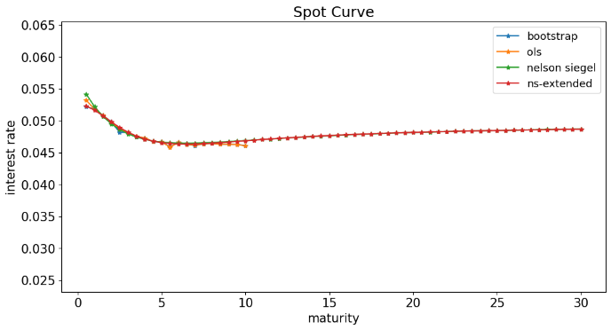{width="90%" height="80%"}
:::

::: center
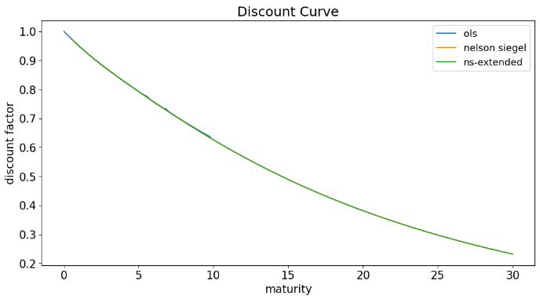{width="90%" height="80%"}
:::

The parameterized functional form lets us evaluate the curve at *any*
maturity, in a smooth way that avoids recommending the extreme long-short
positions that an unrestricted OLS would produce.

:::

The lecturer brought up the fitted spot curve and overlayed the OLS result
side-by-side. His comment: this is exactly what we want from a model --- a
curve that is gently upward-sloping, smooth in maturity, and that interpolates
sensibly to maturities at which no bond has cashflows. Where the OLS curve
oscillated wildly, the Nelson--Siegel curve passes through that region with a
mild hump and continues monotonically.

He then converted the spot curve to the discount curve via $Z(t,T)=e^{-r(t,T)(T-t)}$
and overlayed it on the OLS discount curve. The Nelson--Siegel discount falls
smoothly from $1$ to about $0.4$ over the 30-year horizon; the OLS discount,
by contrast, swings around in the long-end region in ways that have no
financial interpretation.

## Spot Curve vs YTM Curve {#L1-sec:vs-ytm}

:::{.callout-important title="Key concept"}

**Cells 99--105.** *Spot Curves vs YTM.*\
We immediately calculate the YTM for each issue, and plotting these YTMs
against maturity gives a curve. *This YTM curve is not the same as the
spot curve* (often called the *yield curve*, confusingly).

The YTM is a certain average of semi-compounded spot rates over the range of
the issue's maturity. For that reason, we should not be surprised to see the
YTM plot is slightly below the spot plot.

:::

The lecturer laid the YTM scatter --- one dot per outstanding bond, plotted
at its time-to-maturity --- on top of the smooth Nelson--Siegel spot curve
and pointed out the systematic gap. His framing: "YTM is a kind of average
of spot rates. So if the spot curve is upward-sloping, the YTM curve should
sit below it; if downward-sloping, above. That's a generic property of any
weighted average versus the underlying values."

He warned against the casual press habit of calling the YTM curve "the yield
curve" --- the term is used both ways in industry, and you have to read
context to know whether someone means the spot curve, the YTM curve, or
sometimes a CMT (constant-maturity Treasury) curve interpolated by the
Treasury Department itself.

:::{.callout-tip title="Filling the gap"}

**Filling the gap.** The lecturer said "YTM is a certain average of
semi-compounded spot rates" and moved on. The precise statement: for a
zero-coupon bond at maturity $T$, the YTM *equals* the spot rate $r(t,T)$
(modulo the compounding convention). For a coupon bond, the YTM is implicitly
a weighted average where each weight is the present value of that cashflow
divided by the bond's total present value. Because near-maturity cashflows
have larger present values when the curve is upward-sloping, the YTM gets
pulled toward the shorter end of the spot curve --- which is why YTM sits
below the spot curve for upward-sloping curves and above it for inverted
curves.

:::

## Model Prices and Errors {#L1-sec:errors}

:::{.callout-important title="Key concept"}

**Cells 106--114.** *Model Prices and Errors.*\
How well does Nelson--Siegel fit market prices? How well do the bootstrap
and OLS do? The notebook defines a helper `compare_pricing` (a
function-definition cell with no output of its own) and then calls
`plot_prices(price_comp_*, label)` four times, once per fitted
model and once for the raw quotes. The four resulting price-residual
panels are stacked below; for the helper code itself see the live page
at `discussions/1.1. The Spot Discount Curve.html`, section
*Model Prices and Errors*.

::: center
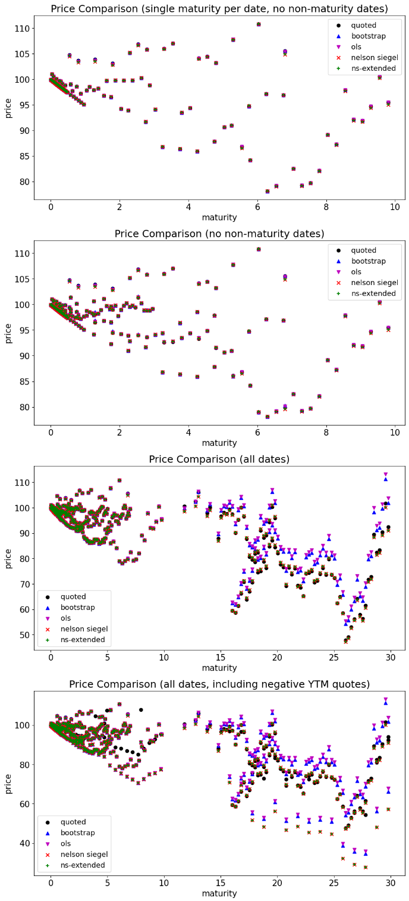{width="90%" height="80%"}
:::

The plot shows price residuals for each fitted model across maturities. The
Nelson--Siegel residuals are larger than the bootstrap or OLS residuals
in-sample --- exactly the symptom we expect when we trade in-sample fit
quality for out-of-sample stability.

:::

The lecturer flagged the apparent paradox here and resolved it explicitly:
"Nelson--Siegel still has higher pricing errors in-sample because we
restricted ourselves to four parameters. The bootstrap will fit every bond it
sees *exactly* when the restrictions are tight enough, and OLS comes
close. But the bootstrap and OLS have no way to price a bond that wasn't in
the estimation set, and they generalize horribly to maturities where no bond
matures. Nelson--Siegel sacrifices a little in-sample accuracy to give us a
curve we can actually use for any maturity."

This is the philosophical takeaway he wanted students to leave the spot-curve
material with: *a parametric model trades in-sample fit for usability
out of sample*. Every fixed-income model in the rest of the course will
involve some version of this tradeoff.

# Forward Rates {#L1-sec:fwd}

## Motivation {#L1-sec:fwd-motiv}

:::{.callout-important title="Key concept"}

**Cells 0--4.** *Forward Rates.*\
A given date's term structure encodes information about rates in the future.

**Example.** Suppose an investor will be receiving (risk-free) \$100
million in six months ($T_1=0.5$) and wants to lock in the interest rate at
which that money will be invested between $T_1$ and $T_2 = 1$. What rate can
the investor lock in today?

:::

The lecturer started 1.2 by drawing a timeline on the whiteboard with three
marked points: today $t=0$, six months out $T_1$, and twelve months out $T_2$.
He framed the example concretely --- a corporate treasurer expects \$100m
arriving in six months and wants to commit *today* to where it will sit
between months 6 and 12 --- and then asked the class: what rate should he
quote, and what is the no-arbitrage value of that rate?

## Looking at the Data {#L1-sec:fwd-data}

:::{.callout-important title="Key concept"}

**Cells 5--7.** *Looking at the Data.*\
Consider the quoted treasuries on the date shown below.

::: center
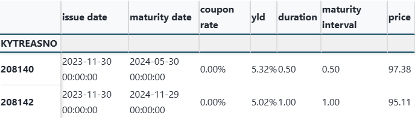{width="90%" height="80%"}
:::

:::

The lecturer showed the cell output: two zero-coupon Treasury rows, one
maturing at $T_1 = 0.5$ years and one at $T_2 = 1$ year. He read off the
prices and noted that "these are the only two instruments we need." The
rest of the derivation uses just these two prices and the no-arbitrage
constraint.

## The Answer: Forward Rate via Replication {#L1-sec:fwd-answer}

:::{.callout-important title="Key concept"}

**Cells 8--13.** *The answer.*\
The rate we can guarantee today, effective starting 6 months from now,
through 12 months from now, is given below.

- Sell a forward contract today ($t$) to receive 100m in 6 months for
  repayment in 12 months with the TBD forward interest rate.

- Simultaneously at $t$, sell short the 6mo T-bill and use the
  proceeds to invest in the 12mo T-bill.

- At 6mo, use the proceeds from the forward counterparty to repay the
  6mo treasury.

- At 12mo, use the proceeds from the 12mo T-bill to pay off the
  forward loan.

We have a perfectly hedged position at all times. Thus, the forward rate must
equal the gain from the 12mo tbill.

::: center


```{=html}
<div class="table-scroll">
<table border="1" class="dataframe">
<thead>
<tr style="text-align: right;">
<th></th>
<th>issue date</th>
<th>maturity date</th>
<th>outstanding</th>
<th>coupon rate</th>
<th>yld</th>
<th>duration</th>
<th>maturity interval</th>
<th>price</th>
</tr>
<tr>
<th>KYTREASNO</th>
<th></th>
<th></th>
<th></th>
<th></th>
<th></th>
<th></th>
<th></th>
<th></th>
</tr>
</thead>
<tbody>
<tr>
<th>208140</th>
<td>2023-11-30</td>
<td>2024-05-30</td>
<td>NaN</td>
<td>0.0</td>
<td>0.053167</td>
<td>0.49863</td>
<td>0.498289</td>
<td>97.383750</td>
</tr>
<tr>
<th>208142</th>
<td>2023-11-30</td>
<td>2024-11-29</td>
<td>NaN</td>
<td>0.0</td>
<td>0.050157</td>
<td>1.00000</td>
<td>0.999316</td>
<td>95.107986</td>
</tr>
</tbody>
</table>
</div>
```

{width="90%" height="80%"}
:::

:::

This is the core derivation of the lecture. The lecturer walked through it
slowly on the whiteboard, with the class chiming in at each step. His
phrasing: "forget for a moment that there is such a thing as a forward
contract. We have two T-bills with cashflows we can read off the screen.
What's the cheapest, simplest way to manufacture the cashflow stream of a
\$100m loan at $T_1$ to be repaid at $T_2$?" The replication
--- short the 6mo, long an equal dollar amount of the 12mo --- has zero net
cash today, produces a $-\$100$m flow at $T_1$ (the 6mo coming due), and a
$+P_2/P_1 \cdot 100$m flow at $T_2$ (the maturing 12mo). That cashflow stream
*is* a 6mo--12mo loan at the rate that solves
$P_2/P_1 = 1/(1+f/2)$, hence the forward rate.

:::{.callout-tip title="Filling the gap"}

**Filling the gap.** The lecturer wrote "the forward rate must equal
the gain from the 12mo t-bill" but didn't write the algebra. Setting up:
the dollar position takes today's $\$100\text{m}\cdot p_1$ short on the 6mo
(receives that cash) and applies it to buy $\$100\text{m}\cdot p_1 / p_2$
face of the 12mo (i.e., a quantity of the 12mo whose cost is the same
$\$100\text{m}\cdot p_1$). At $T_1$, the 6mo matures and demands \$100m of
face --- received from the forward counterparty per the agreement. At $T_2$,
the 12mo matures, paying $\$100\text{m}\cdot p_1/p_2$ of face. That $T_2$
cashflow is exactly what the forward counterparty receives in repayment of
the \$100m it advanced at $T_1$. So the implied semi-annually-compounded
forward rate $f$ satisfies
$$1 + f/2 \;=\; \frac{p_1}{p_2} \;=\; \frac{Z(0,T_1)}{Z(0,T_2)},$$
which is the basic forward-rate identity in semi-compounded form.

:::

## The Guaranteed Forward Rate {#L1-sec:fwd-guar}

:::{.callout-important title="Key concept"}

**Cells 14--16.** *The guaranteed forward rate.*\
Given this forward dollar exposure, the investor is guaranteed the following
semiannual compounded rate:

::: center


```{=html}
<div class="table-scroll">
<table id="T_6d0df">
<thead>
<tr>
<th class="blank level0"> </th>
<th class="col_heading level0 col0" id="T_6d0df_level0_col0">forward investment</th>
</tr>
</thead>
<tbody>
<tr>
<th class="row_heading level0 row0" id="T_6d0df_level0_row0">investment at $T_1$</th>
<td class="data row0 col0" id="T_6d0df_row0_col0">100.00</td>
</tr>
<tr>
<th class="row_heading level0 row1" id="T_6d0df_level0_row1">distribution at $T_2$</th>
<td class="data row1 col0" id="T_6d0df_row1_col0">102.39</td>
</tr>
<tr>
<th class="row_heading level0 row2" id="T_6d0df_level0_row2">interest rate between $T_1$ and $T_2$</th>
<td class="data row2 col0" id="T_6d0df_row2_col0">4.79%</td>
</tr>
</tbody>
</table>
</div>
```

{width="90%" height="80%"}
:::

:::

## Interim Risk {#L1-sec:fwd-interim}

:::{.callout-important title="Key concept"}

**Cells 17--21.** *Interim Risk.*\
Above, we did not deal with the price of the forward replication *but
for the special dates* $t$, $T_1$, $T_2$. The forward replication's value
will move over the interim. It is replicated by treasuries, so it is subject
to interest-rate risk.

::: center
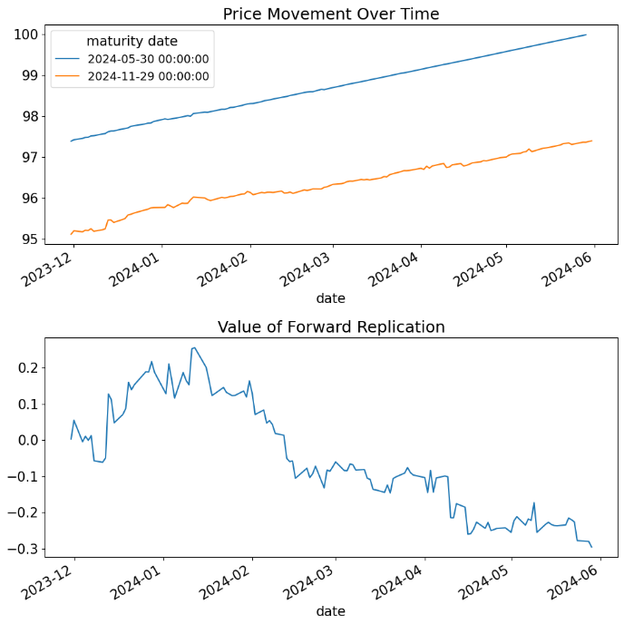{width="90%" height="80%"}
:::

:::

The lecturer was careful to distinguish two things that students often
conflate. *The forward rate is locked in today.* The eventual cashflow
stream at $T_1$ and $T_2$ is exactly the $-100$m / $+100\text{m}\cdot p_1/p_2$
pattern, no matter what happens in between. *But the mark-to-market
value of the replicating portfolio fluctuates*, because both the 6mo short
and the 12mo long are sensitive to interest rates over the holding period.
That is the "interim risk" the slide names: not a risk to the locked-in
rate, but a risk to the funding entity's accounting until the contract
unwinds.

## Calculating Forward Rates {#L1-sec:fwd-calc}

:::{.callout-important title="Key concept"}

**Cells 22--27.** *Calculating Forward Rates.*\
Extract the forward rate from the spot curve $r(t,T)$, or equivalently, from
the discount curve $Z(t,T)$.

**Forward Discount Factors.** Define
$$F(t,T_1,T_2) \;=\; \frac{Z(t,T_2)}{Z(t,T_1)}.$$
**Forward Discount Rates.** The forward discount rate is given as
$$f(t,T_1,T_2) \;=\; -\frac{\ln F(t,T_1,T_2)}{T_2 - T_1}
                    \;=\; \frac{r(t,T_2)\,(T_2-t) \;-\; r(t,T_1)\,(T_1-t)}{T_2 - T_1}.$$

:::

The lecturer derived $F$ from first principles on the board. "If
$Z(t,T_1)$ is the discount factor for a dollar at $T_1$, and $Z(t,T_2)$ is
the discount factor for a dollar at $T_2$, then the rate at which I can lock
in moving money from $T_1$ to $T_2$ is the rate at which the $T_2$-dollar is
worth less than the $T_1$-dollar today." The ratio
$Z(t,T_2)/Z(t,T_1)$ is by definition that smaller fraction, and taking
$-\ln/(T_2-T_1)$ converts it to a continuously-compounded rate.

## The Forward Curve {#L1-sec:fwd-curve}

:::{.callout-important title="Key concept"}

**Cells 28--32.** *The Forward Curve.*\
The forward curve holds constant $t$ and the interval $\Delta = T_2 - T_1$
while varying $T_1$:
$$f(t, T, T+\Delta).$$
When holding the interval between $T_1$ and $T_2$ constant at $\Delta$, it is
common to vary $T$.

:::

So the analog of the spot curve --- a function of one maturity argument --- is
the forward curve as a function of $T$ at fixed $\Delta$. The lecturer drew
both on the same axis: the spot curve and the $\Delta=1$-year forward curve
sitting on top of each other. Because the forward rate is essentially a
*derivative* of the spot rate (in the calculus sense, scaled by $\Delta$),
the forward curve sits above the spot curve when the spot curve is rising and
below it when the spot curve is falling --- a relationship he asked the class
to verify intuitively before showing the picture.

## Extracting the Forward Curve from the Spot Curve {#L1-sec:fwd-extract}

:::{.callout-important title="Key concept"}

**Cells 33--42.** *Extracting the forward curve from the spot curve.*\
Using the formulas above, calculate
$$\{r(t,T_1),\, r(t,T_2)\}
    \;\Longrightarrow\; \{Z(t,T_1),\, Z(t,T_2)\}
    \;\Longrightarrow\; F(t,T_1,T_2)
    \;\Longrightarrow\; f(t,T_1,T_2).$$
Apply this to data using the spot curves estimated on the dates
`quote_dates = [‘2006-12-29’, ‘2018-12-31’, ‘2020-12-31’, ‘2022-12-30’, ‘2023-11-30’]` and examining `2023-11-30`; the
exact `extract_spot_curves` call is on the live page at
`discussions/1.2. Forward Rates.html`, section *Extracting
the forward curve from the spot curve*.

:::

:::{.callout-important title="Key concept"}

**Cells 39--41 (output).**\

::: center
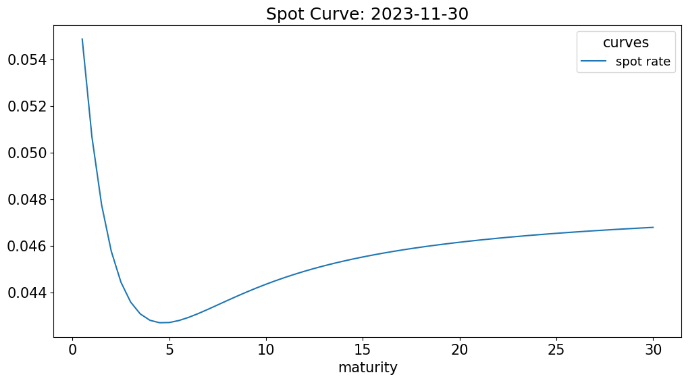{width="90%" height="80%"}
:::

::: center
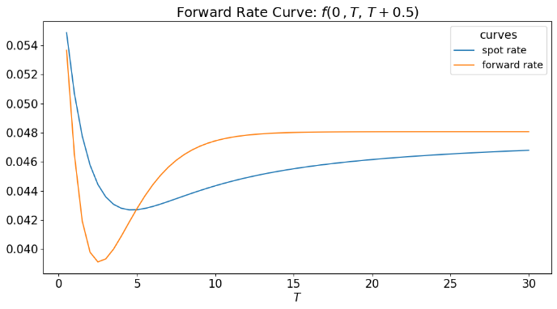{width="90%" height="80%"}
:::

::: center
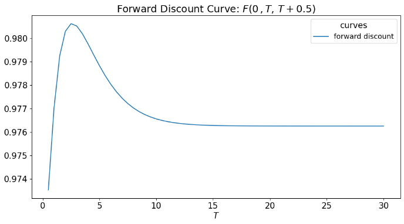{width="90%" height="80%"}
:::

The first plot shows the spot rate curve as of 2023-11-30. The second
overlays the forward rate curve $f(0,T,T+\Delta)$ at $\Delta = 1$ year on
top of the spot curve. The forward curve sits *above* the spot curve
where the spot curve is rising (early- and mid-curve) and crosses below where
it flattens out at the long end.

**Relationship between the spot and forward curves.** The forward curve
is closely related to the spot curve: it is essentially a scaled marginal
rate. Where the spot curve has a steep upward slope, the corresponding
forward curve sits well above it. Where the spot curve is flat or falling,
the forward curve dips below.

:::

## Compounding for Forward Rates {#L1-sec:fwd-compound}

:::{.callout-important title="Key concept"}

**Cells 43--50.** *Compounding.*\
As for any rate, we must specify the compounding. Above, $f(t,T_1,T_2)$ is
continuously compounded, as is the spot rate $r(t,T)$. We convert to a
frequency-$n$ compounded forward rate via
$$f_n(t,T_1,T_2) \;=\; n\!\left[\!\left(\frac{1}{F(t,T_1,T_2)}\right)^{1/(n(T_2-T_1))} - 1\right].$$
Note that $F$ is defined irrespective of compounding; compounding only
impacts the rate $f$.

Typically we focus on continuously-compounded forward rates, as we do for
spot rates.

:::

The lecturer cautioned the class about a subtlety here: although the forward
discount factor $F$ is convention-free, market quotes of forward rates are
almost always semi-annually compounded (US Treasury) or annually compounded
(European convention), so when reading a quoted forward rate off a screen
you must always confirm the compounding convention before using it as the
$f$ in any of these equations. He paired this warning with a recommendation:
*always store $F$ internally and convert to a rate at the boundary of
your computation when you need to display or compare*.

## Extracting the Spot Curve from the Forward Curve {#L1-sec:fwd-spot}

:::{.callout-important title="Key concept"}

**Cells 51--57.** *Extracting the spot curve from the forward curve.*\
It is possible to "bootstrap" the spot curve from forward rates. Consider:
$$Z(0,T_n) \;=\; Z(0,T_{n-1})\, e^{-f(0,T_{n-1},T_n)\,(T_n - T_{n-1})}.$$
**Converting to the spot rate:**
$$r(0,T_n) \;=\; \frac{1}{T_n}\sum_{i=1}^{n} f(0,T_{i-1},T_i)\,(T_i - T_{i-1}).$$

:::

The lecturer pointed out the natural symmetry: just as we extracted forward
rates from spot rates by taking ratios of discount factors, we can extract
spot rates from forward rates by chaining discount factors back together.
The spot rate at maturity $T_n$ is the (time-weighted) average of all the
forward rates $f(0,T_{i-1},T_i)$ that bridge today to $T_n$.

## A Smooth Spot Curve? {#L1-sec:fwd-smooth}

:::{.callout-important title="Key concept"}

**Cells 58--61.** *A Smooth Spot Curve?*\
Given that the forward curve is a derivative of the spot curve, a small
measurement error in the spot curve produces a much larger error in the
forward curve.

::: center
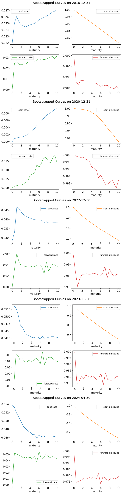{width="90%" height="80%"}
:::

:::

The lecturer emphasized that this is the practical reason the smoothing
matters. "If you bootstrap a spot curve and then differentiate it to get a
forward curve, the forward curve looks like garbage --- jagged, with huge
swings between adjacent maturities. That's not a problem with the forward
formula; it's the spot estimation noise being amplified by differentiation.
That's why we use Nelson--Siegel: a smooth spot curve gives a smooth forward
curve."

## Forward Rate Agreements {#L1-sec:FRA}

:::{.callout-important title="Key concept"}

**Cells 62--64.** *Forward Rate Agreements.*\
**Definition.** A Forward Rate Agreement (FRA) is similar to the
financing provided in the example at the start of the note. It is a contract
agreed today to exchange interest at a pre-agreed rate $f_n(0,T_1,T_2)$
versus the spot rate observed at $T_1$ for the period $T_1$ to $T_2$ on a
notional principal $N$.

**No-arbitrage replication.** Like the forward loan described at the
start, the FRA can be replicated by combining a long position in a $T_2$
zero-coupon bond and a short position in a $T_1$ zero-coupon bond.

:::

The lecturer described an FRA in plain words as the OTC instrument that puts
the forward-rate replication into a single contract. "Why bother going
through the replication every time?" he asked. "You don't. You call your
counterparty and you ask for an FRA at a specified notional, $T_1$, and
$T_2$. They quote you the forward rate. You agree, and on the start date
$T_1$ they cash-settle the difference between the agreed rate and the
realized spot rate." This makes the FRA the natural over-the-counter
instrument for locking in a future short rate.

## Forward Contracts on Treasury Bonds {#L1-sec:fwd-contract}

:::{.callout-important title="Key concept"}

**Cells 65--72.** *Forward Contracts.*\
**Definition.** A forward contract is an agreement to buy a bond with
maturity $T$ at a specific future date $T_0$ at a specific price
$P_{\text{Fwd}}(t,T_0,T)$. Here $T_0$ is the date of the forward and $T$ is
the date of the bond's maturity.

**Initialization.** The forward price is set such that there is no
upfront price to initiate the forward.

**Final payoff.** The final payoff from the long forward contract is
$P(T_0, T) - P_{\text{Fwd}}(t,T_0,T)$.

**Price vs Value.** As with FRAs, it is important to distinguish the
forward *price* (the agreed exchange price) from the forward
*value* (the mark-to-market of the contract).

:::

:::{.callout-tip title="Filling the gap"}

**Filling the gap.** The lecturer used "price" and "value"
distinctly without writing the formal distinction. The forward *price*
$P_{\text{Fwd}}(t,T_0,T)$ is the strike: the dollar amount that one party
pays at $T_0$ to receive the bond. It is set at $t$ (today) so that the
contract has zero value at initiation. The forward *value*
$V_{\text{Fwd}}(s,T_0,T)$ at any later date $s>t$ is the present value of the
contract, which is generally non-zero because the underlying bond's price has
moved since $t$. The standard relation:
$$V_{\text{Fwd}}(s,T_0,T) \;=\;
       Z(s,T_0)\bigl[P_{\text{Fwd}}(s,T_0,T) - P_{\text{Fwd}}(t,T_0,T)\bigr],$$
i.e., the difference in forward prices, discounted from $T_0$ back to $s$.

:::

## Pricing Forward Contracts on Treasuries {#L1-sec:fwd-treas}

:::{.callout-important title="Key concept"}

**Cells 73--82.** *Forward Contracts on Treasury Bonds --- Pricing.*\
Pricing forward contracts on Treasuries is straightforward: *just use
the forward discount* $F(t,T_0,T)$ *instead of* $Z(t,T)$.

**Zero coupon bond.** Consider a zero-coupon bond maturing at $T$ with
face value 100. The forward price is
$$P_{\text{Fwd}}(t,T_0,T) \;=\; 100 \, F(t,T_0,T).$$
**Coupon bond.** Consider coupons at $T_i$ with final principal at $T$:
$$P_{\text{Fwd}}(t,T_0,T)
       \;=\; 100\,\frac{c}{2}\sum_{i=1}^{n} F(t,T_0,T_i)
              \;+\; 100\, F(t,T_0,T).$$

**Example.** The forward contract can achieve the same as the FRA
above. For an investor receiving \$100m at $T_1=6$ months wishing to lock in
the rate to $T_2 = 12$ months, go long the forward contract on the
$T_2$-T-bill at $T_1$.

::: center


```{=html}
<div class="table-scroll">
<table id="T_53fa0">
<thead>
<tr>
<th class="blank level0"> </th>
<th class="col_heading level0 col0" id="T_53fa0_level0_col0">issue date</th>
<th class="col_heading level0 col1" id="T_53fa0_level0_col1">maturity date</th>
<th class="col_heading level0 col2" id="T_53fa0_level0_col2">coupon rate</th>
<th class="col_heading level0 col3" id="T_53fa0_level0_col3">yld</th>
<th class="col_heading level0 col4" id="T_53fa0_level0_col4">duration</th>
<th class="col_heading level0 col5" id="T_53fa0_level0_col5">maturity interval</th>
<th class="col_heading level0 col6" id="T_53fa0_level0_col6">price</th>
</tr>
<tr>
<th class="index_name level0">KYTREASNO</th>
<th class="blank col0"> </th>
<th class="blank col1"> </th>
<th class="blank col2"> </th>
<th class="blank col3"> </th>
<th class="blank col4"> </th>
<th class="blank col5"> </th>
<th class="blank col6"> </th>
</tr>
</thead>
<tbody>
<tr>
<th class="row_heading level0 row0" id="T_53fa0_level0_row0">208140</th>
<td class="data row0 col0" id="T_53fa0_row0_col0">2023-11-30 00:00:00</td>
<td class="data row0 col1" id="T_53fa0_row0_col1">2024-05-30 00:00:00</td>
<td class="data row0 col2" id="T_53fa0_row0_col2">0.00%</td>
<td class="data row0 col3" id="T_53fa0_row0_col3">5.32%</td>
<td class="data row0 col4" id="T_53fa0_row0_col4">0.50</td>
<td class="data row0 col5" id="T_53fa0_row0_col5">0.50</td>
<td class="data row0 col6" id="T_53fa0_row0_col6">97.38</td>
</tr>
<tr>
<th class="row_heading level0 row1" id="T_53fa0_level0_row1">208142</th>
<td class="data row1 col0" id="T_53fa0_row1_col0">2023-11-30 00:00:00</td>
<td class="data row1 col1" id="T_53fa0_row1_col1">2024-11-29 00:00:00</td>
<td class="data row1 col2" id="T_53fa0_row1_col2">0.00%</td>
<td class="data row1 col3" id="T_53fa0_row1_col3">5.02%</td>
<td class="data row1 col4" id="T_53fa0_row1_col4">1.00</td>
<td class="data row1 col5" id="T_53fa0_row1_col5">1.00</td>
<td class="data row1 col6" id="T_53fa0_row1_col6">95.11</td>
</tr>
</tbody>
</table>
</div>
```

{width="90%" height="80%"}
:::

::: center
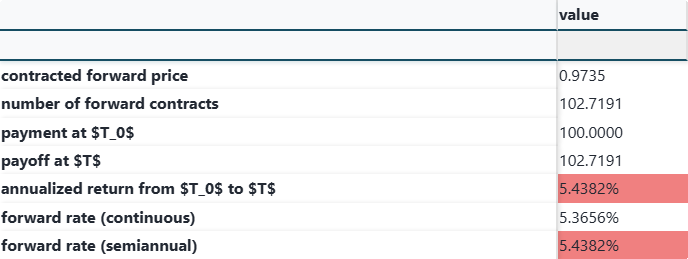{width="90%" height="80%"}
:::

:::

This is the cleanest moment of the lecture. The forward-discount-factor
$F(t,T_0,T)$ is exactly the forward price of a zero-coupon bond, and the
coupon-bond formula is just the same sum-of-discounts pricing identity from
1.1, except that every $Z$ is replaced with the corresponding $F$. The
lecturer commented: "Once you have the forward discount factor, pricing a
forward contract is the same exercise as pricing the bond itself --- just
with a different discount."

## Appendix: Mathematical Details on FRAs {#L1-sec:fra-math}

:::{.callout-important title="Key concept"}

**Cells 87--93.** *Appendix: FRA Value.*\
The equation above gives the net cashflow of the FRA at maturity. The value
of the FRA at any time $t$ is the cashflow discounted by the appropriate
spot discount factor:
$$V_{\text{FRA}}(t;0,T_1,T_2)
       \;=\; N\Delta\bigl[f_n(0,T_1,T_2) - f_n(t,T_1,T_2)\bigr] Z(t,T_2),$$
where $\Delta = T_2 - T_1$, $N$ is the notional, and the value depends on
*four* dates: the initialization date $t=0$, the valuation date $t$, the
spot rate fix date $T_1$, and the cashflow date $T_2$.

:::

:::{.callout-important title="Key concept"}

**Cells 96--100.** *Boundaries.*\
For $t = 0$, the value is $0$:
$$V_{\text{FRA}}(0;0,T_1,T_2)
      \;=\; N\Delta\bigl[f_n(0,T_1,T_2) - f_n(0,T_1,T_2)\bigr]Z(0,T_2)
      \;=\; 0,$$
which is the no-arbitrage condition that the FRA has zero value at
initiation. For $t = T_1$, the value collapses to the realized vs. agreed
rate spread.

::: center
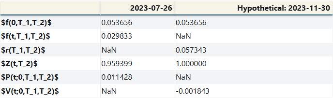{width="90%" height="80%"}
:::

:::

The lecturer's summary: the FRA's value is a forward-rate *spread*
discounted to the present. As the realized forward rate $f_n(t,T_1,T_2)$
moves over time, the value moves linearly with it, weighted by the notional,
the period length, and the discount.

## Appendix: No-Arbitrage Construction of the Forward Rate {#L1-sec:fwd-noarb}

:::{.callout-important title="Key concept"}

**Cells 110--124.** *Forward Rates via No-Arbitrage.*\
The answer above is implied by the two Treasury securities along with an
assumption of no arbitrage. We can use the time-$t$ offerings to replicate
saving between $T_1$ and $T_2$ by combining cashflows from a forward, a
short of the $T_1$ bill, and the proceeds applied to a long of the
$T_2$ bill.

The chart below shows the quantity, price, and dollar position at each
point in time $t$, $T_1$ (gross), $T_1$ (net), $T_2$ (gross), $T_2$ (net).
The financer has a net-zero position at every point in time --- that is,
every column of the dollar-position table sums to zero --- which is the
defining property of the no-arbitrage replication.

:::

:::{.callout-important title="Key concept"}

**Cells 125--127 (output).**\
With the forward prices set as derived, the replicating portfolio has a
net-zero dollar total at $t$, $T_1$, and $T_2$. The lecturer projected the
two coloured tables (`arb_chart[’price’]` highlighted in light yellow,
`bank_position` highlighted in light blue) and walked the class
through each row, confirming that every gross-and-net pairing sums to zero.

:::

The lecturer closed the forward-rates discussion with this no-arbitrage
diagram and then transitioned, with about fifteen minutes remaining, to a
preview of notebook 1.3 (the Expectations Hypothesis). That preview is
properly part of Lecture 2 and is not reproduced here. He emphasized that
the forward rate is *not* the market's expectation of the future spot
rate --- it is the no-arbitrage rate implied by today's spot curve --- and
the Expectations Hypothesis is the (often-rejected) hypothesis that these
two coincide. We return to that in Lecture 2.

# Closing Notes {#closing-notes .unnumbered}

This lecture introduced the spot discount curve, $Z(t,T)$, as the primitive
object of fixed-income pricing, derived two estimation procedures (bootstrap
and OLS) under heavy data restrictions, demonstrated why both fail when the
restrictions are loosened (multicollinearity in $\mathbf{C}$), and motivated
the Nelson--Siegel parametric model as the practical solution. It then
introduced the forward rate $f(t,T_1,T_2)$ as the no-arbitrage rate locked in
today for a future period, derived its replication via two zero-coupon bonds,
and showed how the forward curve is extracted from the spot curve and
vice-versa. The forward rate agreement (FRA) and forward contracts on
Treasury bonds were introduced as the OTC instruments that package the
replication into a single contract. The next lecture takes up the
Expectations Hypothesis and begins the analysis of duration and convexity.
