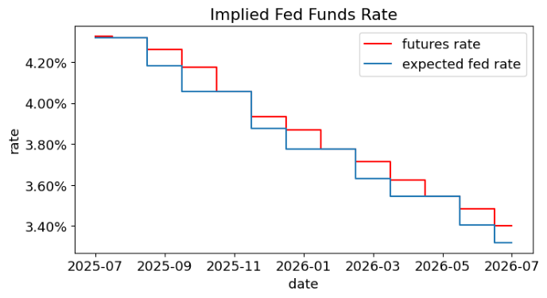
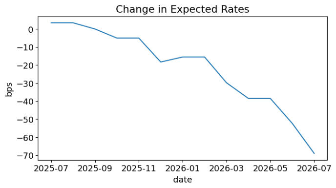
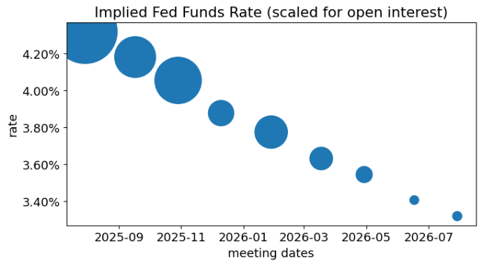
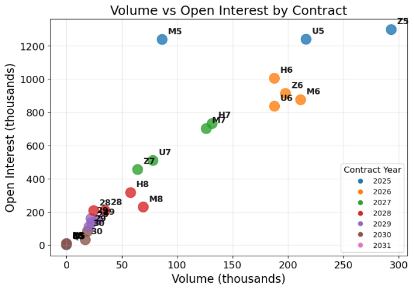
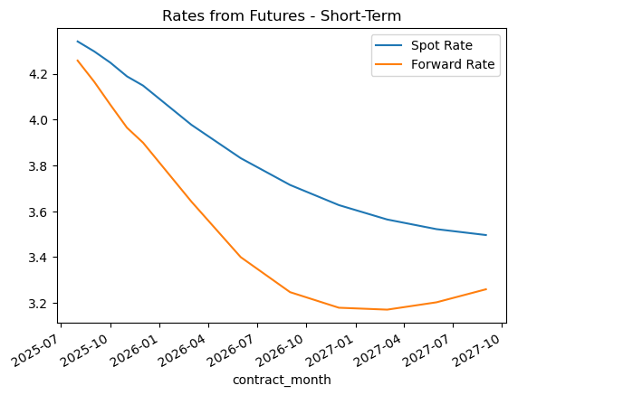

<!-- AUTO-GENERATED by scripts/convert.py — do not edit. -->

Week 3 was split across two sittings because of the Martin Luther King Day
holiday: a short Tuesday Zoom discussion on the Treasury arbitrage case
(about 59 minutes), followed by a Wednesday morning class (about two hours)
that did the substantive material on short-term interest-rate (STIR) futures.
These notes preserve that order. The first section is a case-study walkthrough
from the Tuesday session --- there is no companion notebook, just the
*Treasury Arbitrage in 2008* HBS case (Parts A and B) and the live
spreadsheet the lecturer shared. The remainder of the lecture covers
notebooks 3.1 *STIR Futures*, 3.2 *Inferring FF Futures*, and the
calibration half of 3.3 *Discount via SOFR Futures*; the deep dive into
the treasury-futures basket and the cheapest-to-deliver trade starts on
notebook 4.2 and is deferred to Lecture 4.

# Case: Treasury Arbitrage in 2008 {#L3-sec:case}

## Two Treasuries, Same Maturity Date {#L3-sec:case-setup}

The lecturer opened the screen-share with the Bloomberg quote row at the
heart of the HBS case. Two U.S. Treasury issues, both maturing on the same
date in August 2015:

- the 1985 *30-year bond*, now 23 years into its life --- the
  lecturer called it "off the run, way off the run, sitting in the
  vaults of insurance companies, barely trading";

- the 2005 *10-year note*, three years into its life --- not
  on-the-run for the 10Y slot but still recent.

Both are bullet Treasuries issued by the same entity, both mature on the
same day, so their *final* cashflow is identical. Everything else is
different: the 1985 bond carries the high 1980s coupon, the 2005 note the
low 2000s coupon; clean and dirty prices differ by tens of dollars per \$100
face; quoted yields to maturity (YTMs) are 3.58% for the bond and
3.24% for the note. The question the traders were asking in
November 2008 is: *given that these cashflows must converge on the same
August 2015 date, why is the market assigning two different YTMs?*

The lecturer was careful to squash the naive buy-low-sell-high intuition
immediately. Dirty prices are *not* comparable across bonds with
different coupons --- "it's Amazon and Berkshire Hathaway: one share of
Berkshire is worth a lot more than one share of Amazon, and you can't
compare the dollar prices without rescaling." The correct normalized price
is the YTM, because YTM is a *re-scaled* price that factors out the
cashflow schedule. Once the YTMs are on the table, the trade idea is:
*buy low, sell high, but in YTM space the direction flips.* A high YTM
corresponds to a low price, so buying the high-yield bond at
3.58% and shorting the low-yield note at 3.24% is the
trade. Lucy, one of the students on camera, contributed the first cautionary
point: the two issues have wildly different dollar sizes and, more
importantly, different modified durations.

:::{.callout-tip title="Filling the gap"}

**Filling the gap.** The lecturer's slogan "YTM is a rescaled price"
hides a small derivation. For a coupon bond with cashflows $c_i$ at times
$T_i$, the YTM $y$ is the unique root of
$$P \;=\; \sum_i \frac{c_i}{\bigl(1+y/n\bigr)^{n T_i}},$$
where $n$ is the compounding frequency. When two bonds with different
cashflow schedules produce the same $y$, the market is saying the two
bundles have the same *average* discount rate even though they differ
in every other respect. That is the apples-to-apples comparison the trader
needs --- not the raw prices, which depend on the coupon schedule, and not
the prices per dollar of face, which still confound cashflow timing.

:::

## Sizing the Trade {#L3-sec:case-size}

With the direction of the trade settled, the lecturer walked through how to
*size* it. Three candidate rules were discussed, each one better than
the last:

1.  *One contract long, one short.* This is the dumbest thing you
    could do. The bonds trade at \$106 and \$144 per \$100 face, so this
    is not even dollar-neutral.

2.  *Dollar-neutral.* Buy \$1 of the bond, short \$1 of the note.
    This neutralizes the dollar P&L to a parallel shift, but the two
    securities have different durations (the high-coupon bond has a
    shorter duration than the low-coupon note --- more of its value is
    front-loaded in coupons), so they react differently to a common
    rate move. This is still not a relative-value trade; you have
    residual exposure to the level of rates.

3.  *Dollar-duration-neutral* ("galaxy-brain," in the lecturer's
    phrase). The hedge ratio is chosen so that the *dollar*
    dollar-duration of the long leg equals the dollar dollar-duration of
    the short leg.

A subtlety the lecturer insisted on: duration or *modified* duration?
Both were acceptable, but modified duration is the cleaner fit for this
trade, because the trader is betting on the convergence of two YTMs on
securities with the *same maturity*, not on the evolution of the spot
curve. Modified duration is the percentage price sensitivity to a change in
YTM; scaled by the dirty price, it gives the dollar sensitivity to YTM, and
that is what needs to balance out.

:::{.callout-important title="Key concept"}

**The sized trade (\$1M own capital, 2% repo haircut).**
$$P^{\text{long}} \;=\; \text{\$50M notional} \;\text{of the 1985 bond, financed through 1-day repo},$$
$$P^{\text{short}} \;=\; \text{\$44M notional} \;\text{of the 2005 note, sized so that}
  \quad \mathrm{MD}^{\text{long}} \cdot P^{\text{long}} \;=\; \mathrm{MD}^{\text{short}} \cdot P^{\text{short}}.$$
The own-capital outlay is \$1M long plus \$880K short collateral.

:::

The repo mechanics --- Jared the dealer, Annie the cash-rich repo
counterparty, the lecturer the trader --- are worth spelling out because
they reappear throughout the course. The trader buys \$50M of the bond from
Jared, immediately hands the bonds to Annie as collateral, and borrows
\$49M from her in cash; the trader contributes the remaining \$1M from the
firm's capital. The 2% haircut is Annie's buffer against an overnight
crash in Treasury value. Because the lecturer keeps the right to repurchase
the bonds from Annie the next morning, the trader retains all price
exposure --- Annie is just financing overnight at a repo rate that is tiny
compared to the profit opportunity, so the lecturer brushed it aside for
this pass.

## The Expected Profit {#L3-sec:case-pnl}

With the position sized for dollar-duration neutrality, the lecturer worked
out the expected P&L if the YTM spread converges from 35 bp to zero. A
symmetric-convergence assumption (each YTM moves halfway, 17.5 bp) gives a
profit of roughly \$435K on each leg, or about \$871K total. Because
duration is a linear (calculus-style) approximation, the exact split
between the two legs does not matter --- any decomposition of the 35 bp
convergence gives roughly the same total P&L at first order.

:::{.callout-tip title="Filling the gap"}

**Filling the gap.** The 25K-per-basis-point sensitivity is the
compact statement of
$$\Delta \mathrm{P\&L} \;\approx\; -\,\mathrm{MD}^{\text{long}} \cdot P^{\text{long}} \cdot \Delta y^{\text{long}}
  \;-\; \bigl(-\mathrm{MD}^{\text{short}} \cdot P^{\text{short}} \cdot \Delta y^{\text{short}}\bigr).$$
If the dollar-durations are matched,
$\mathrm{MD}^{\text{long}} P^{\text{long}} = \mathrm{MD}^{\text{short}} P^{\text{short}} \equiv D^\$$, and a symmetric convergence
$\Delta y^{\text{long}} = -\tfrac12 \Delta s$, $\Delta y^{\text{short}} = +\tfrac12 \Delta s$ (so the spread
$s = y^{\text{long}}-y^{\text{short}}$ moves by $\Delta s$) gives
$$\Delta \mathrm{P\&L} \;\approx\; D^\$ \cdot \Delta s.$$
With the numbers the lecturer showed, $D^\$$ works out to roughly
\$25,000 per basis point of spread, so a 35 bp convergence yields
$\approx \$871{,}000$, and a 1 bp move is always worth \$25K regardless of
how it splits between the legs.

:::

Whether \$871K is a lot depends on the denominator. Against the \$50M
notional, it is a 1.7% return --- unexciting. Against the \$1M of own
capital that the lecturer actually put in (or the \$1.8M of long+short if
the risk manager charges both legs), it is somewhere between
46% and 87%. And against the time horizon --- the trader
expected the spread to close in days or weeks, not the seven years until
maturity --- it is the best trade of a career. A student (Utsav) flagged the
hidden tail risk in this calculation: if the spread does not converge
quickly, the trader is paying a repo rate on \$50M every day the position
stays open, and the advertised returns degrade fast. The lecturer agreed
and came back to that point at the end.

## What Actually Happened {#L3-sec:case-what-happened}

The YTM spread did not converge. It *widened*. From the 35 bp level in
early November, it climbed to roughly 60--70 bp through late November and
past Thanksgiving. Using the \$25K-per-basis-point rule, the trader who
entered at 35 bp and watched the spread expand another 35 bp had a paper
loss of $\approx$ \$875K --- nearly the entire capital on the long side.

The lecturer's question: is this a paper loss? The textbook answer is yes
--- the spread must close by maturity, so a trader who can wait will
recover the 35 bp entry profit plus the additional 35 bp that was handed to
them by the divergence. A student (Andrew, paraphrased) supplied the
industry reply: "markets can stay irrational longer than you can stay
liquid." The bond collateral the trader posted to Annie has fallen in
value too --- not by a lot, maybe \$1M on \$50M --- and Annie is entitled to
a margin call for the difference because this is *overnight* repo,
renewed day by day. \$1M of margin is the entire capital the trader started
with. Request the cash from the firm, and the firm's own balance sheet is
under pressure because every other trader is in the same situation in a
crisis.

The mechanic by which this trade killed was identified clearly: when the
firm pulls the plug, the trader has to *unwind* at the worst possible
time. Buying back the shorts pushes the low-yield leg higher in price,
hence lower in YTM. Selling the longs pushes the high-yield leg lower in
price, hence higher in YTM. The spread widens further on the way out.
The lecturer's aphorism: "I wanted to be right and first. I did not want
my competitors to beat me in. But I did need *someone* to come along
and agree with me, or the spread would never close. It turned out that
being the only one right on this trade was what ruined me."

By the following spring, the spread was back near zero and the YTMs had
converged exactly as the trader had originally predicted. The P&L path,
however, ran down to about $-\$1$M before recovering --- a trader with
infinite patience would have collected \$1.2M in the end, but a trader on
a finite balance sheet was forced out in December at the worst part of the
drawdown.

## Was This Really Arbitrage? {#L3-sec:case-arb}

The case is named "Treasury Arbitrage," but the lecturer pushed on the
word. A true arbitrage would have required no borrowing: buy \$1M of the
bond with own capital, short \$1M of the note with own capital, wait up to
six years for the guaranteed convergence, and collect the 35 bp spread
profit --- about 2.5% in total. That *is* a mathematical arbitrage. It
is also, by the lecturer's description, the most boring trade in fixed
income: 2.5% over up to seven years is a 0.35%-per-year return,
well below the repo rate and far below any reasonable hurdle. The whole
reason this trade was exciting in the first place was because of
*leverage* --- 50-to-1 via the 2% haircut on overnight repo. And the
moment the trader borrows, the trade stops being an arbitrage, because the
lender can pull the financing. The lecturer called this a "statistical
arbitrage" in the loose industry sense, not an arbitrage in the portfolio
course's sense, and warned that Professor Ibbotson would fail anyone who
said otherwise.

The lecturer closed the Tuesday session with the participation code
`treasury-basis`, the logistics of moving from Group A to Group B
for the homework, and a promise that Wednesday's class would spend about
90 of its 120 minutes on futures with a short detour on duration and the
Silicon Valley Bank case if time allowed. Futures got the full session; the
detours carried over to Lecture 4.

# STIR Futures {#L3-sec:stir}

Wednesday morning opened with the class looking at the course webpage at
`discussions/3.1. STIR Futures.html`. The lecturer referred several
times to the September markets course, where standard commodity-futures
mechanics were covered (daily settlement, margining, physical vs cash
delivery). Readers who did not take that course can treat the September
material as a prerequisite; the exposition below assumes the basic futures
vocabulary.

## STIR Futures --- Overview and Payoff Convention {#L3-sec:stir-overview}

:::{.callout-important title="Key concept"}

**Cells 1--9.** *(Page 3.1 · STIR Futures.)*\
**Short-Term Interest Rate (STIR) Futures** are contracts
written directly on an interest rate, not a bond.
There are key similarities and differences to other (particularly bond)
futures.

Similarities:

- Trade on an exchange.

- Daily settlement.

Differences:

- Cash settled, so "delivery" is simple cash payment.

- No embedded options.

Specs across most STIR contracts:

- Delivery is last day of the contract month.

- Payoffs are *inversely* related to the reference rate:
  $$N\bigl(1 - r^{\text{ref}}_T\bigr).$$

Thus, when **rates go up, the futures value goes down**.

:::

The lecturer stressed the first two similarities as fully inherited from
the September material: daily settlement means each day's profit or loss
is *realized*, not paper --- the exchange moves cash from the loser's
margin account to the winner's, and the money is legally the winner's
regardless of what happens to the position afterwards. When the loser's
account is drawn down far enough, the exchange issues a margin call, and
failure to fill it liquidates the position.

Cash settlement is the cleanest of the differences. There is no underlying
bond or commodity to deliver; the settlement is computed mechanically from
the reference rate on the expiry date, and a simple cash payment changes
hands. The lecturer said this makes a STIR contract "feel like betting on
an index."

The inverse-proportional payoff structure is more subtle. A trader new to
fixed income might prefer $N \cdot r^{\text{ref}}_T$ --- linear and
positive. The lecturer made a case for the affine, inverted form
$N(1-r^{\text{ref}}_T)$: it is the convention that makes
*every* fixed-income product behave the same way under rate moves.
Cash bonds, Treasury futures, and STIR futures all obey the
"rates up, price down" rule. Long a STIR contract therefore means you
lose when rates rise, exactly as for a long bond.

:::{.callout-tip title="Filling the gap"}

**Filling the gap.** The affine form also makes the STIR future
*hedgeable* against a floating-rate loan. A lender who has extended
a one-month loan with principal $N$ and expected rate $r^{\text{ref}}$
earns $N\bigl(1 + r^{\text{ref}}/12\bigr)$ at maturity. If the lender
shorts one STIR future with notional $N$ referencing the same rate, the
one-period P&L on the short leg is $-N\bigl(r^{\text{ref}}_{t} - r^{\text{ref}}_{t+1}\bigr) \cdot \tfrac{30}{360}$
(using the Fed-funds spec below), which exactly offsets the change in the
loan's interest income. The positive-proportional form $N r^{\text{ref}}$
would fail this hedge --- it would leave a residual loss when rates rise.

:::

## Fed Funds Futures {#L3-sec:stir-fff}

:::{.callout-important title="Key concept"}

**Cells 10--18.** *Fed Funds Futures (FFF).*\
**Reference rate:**

- Simple average of the Fed Funds effective rate.

- Every day in the month is counted in the simple average.

- Non-trading days take the value of the most recent traded day (so
  that value is counted multiple times).

**Sizing:**

- Notional $N = \$5{,}000{,}000$.

- Settlement horizon one month, 30/360 day-count.

The quoted futures price is
$$P_t \;=\; 100\bigl(1 - r^{\text{ref}}_t\bigr),$$
and the contract settles at
$$\$5{,}000{,}000 \cdot \frac{30}{360} \cdot \frac{P_T}{100}.$$
Daily settlement on the contract is
$$\begin{align*}
  \mathrm{PnL} &= \$5{,}000{,}000 \cdot \frac{30}{360} \cdot \frac{P_{t+1}-P_t}{100} \\
  &= \$5{,}000{,}000 \cdot \frac{30}{360}\bigl(r^{\text{ref}}_t - r^{\text{ref}}_{t+1}\bigr).
\end{align*}$$
Each **increase** of 1 bp in the reference index is
$$\mathrm{PnL} \;=\; -\$41.67.$$

:::

The lecturer drew out the mechanics slowly. The reference rate is the Fed
*funds effective* rate --- the rate at which bank A lends to bank B
through the banks' reserve accounts at the Fed, averaged simply over every
calendar day in the month. Non-trading days are filled in with the most
recent traded rate, so Friday's rate is counted three or four times over a
weekend; the rationale is that the futures contract is trying to mimic the
economics of an actual one-month loan, and in a repo-style loan the
borrower does pay interest over the weekend, with the counted days divided
by 360 rather than 365 (the 5-day gap is absorbed into a slightly lower
quoted rate, a convention both sides accept).

The lecturer paused on the odd status of the Fed funds rate itself. It is
the U.S. economy's benchmark policy rate, yet the transaction it names ---
bank A lending to bank B overnight --- barely happens anymore. Modern
money-center banks park reserves at the Fed directly and earn interest on
reserves (IOR), which creates a floor: no bank A will lend below IOR because
it can just earn IOR from the Fed. A banded discount window or the Fed's
repo facilities provide the ceiling. The effective Fed funds rate is thus
"so well sandwiched by the Fed's direct operations that you might as well
treat it as a direct Fed-set rate," which is what markets in fact do.

The sizing conventions --- the \$5M notional and the 30/360 scaling --- look
arbitrary but are chosen so that the dollar P&L per basis point is a
convenient round number. The lecturer worked it out: a 1 bp change in the
reference rate moves the quoted price by 1 basis point (since
$P = 100(1-r)$), which is \$0.01 per \$100; scale by \$5M notional and
multiply by 30/360 and you get
$$\$5{,}000{,}000 \cdot \frac{30}{360} \cdot 0.0001 \;\approx\; \$41.67$$
per basis point. The sign is negative because a rate rise corresponds to a
price fall for the long position.

:::{.callout-tip title="Filling the gap"}

**Filling the gap.** The factor of $\tfrac{30}{360}$ is not really
about calendar days --- in February it does not become $\tfrac{28}{360}$ ---
it is an annualization adjustment. The reference rate is quoted
annualized, but the contract covers only one month, so the payoff scales
by $\tfrac{1}{12}$. Writing $\tfrac{30}{360}$ instead of $\tfrac{1}{12}$
preserves the money-market convention that pervades fixed-income
arithmetic, but the economic content is just monthly-pro-rating an
annualized rate.

:::

The margin requirement is modest, in line with the small per-basis-point
exposure. On a non-FOMC-meeting month the reference rate barely moves and
the P&L stays in the low hundreds of dollars per contract. On an
FOMC-meeting month the rate can jump 25 bp or, in crisis conditions,
50 bp, implying a one-day P&L around \$1--2K per contract --- still small
compared to the contract's notional. The exchange sets margin at roughly
the worst plausible one-day move and leaves it in place for years at a
time.

## Market Expectations from FFF {#L3-sec:stir-market-exp}

:::{.callout-important title="Key concept"}

**Cell 19.** *Market Expectations.*\
The quoted Fed Funds futures prices are used to extract the market
expectation of whether the Fed will raise or lower rates at future meetings.
These are extracted from the futures prices.

:::

The lecturer previewed the point that gets its full treatment in
notebook 3.2: because the reference rate is so tightly pinned by Fed
operations between meetings, the only systematic source of variation in the
reference rate is a Fed decision. The futures price at a given expiry
therefore encodes the market's weighted-average expectation of the Fed
funds rate over that month, and by comparing successive expiries around
each FOMC date one can back out the implied expected move at each meeting.
This is why, when a newscast quotes "the market is pricing in a 40%
chance of a 25 bp cut at the March meeting," the number comes from Fed
funds futures prices, not from a prediction market or a survey. The
lecturer added that there is far more capital at stake in FFF than in any
prediction market, which makes the futures-implied expectation the most
reliable signal available.

## SOFR --- Rate and Futures {#L3-sec:stir-sofr}

:::{.callout-important title="Key concept"}

**Cells 20--23.** *Understanding SOFR.*\
**What is SOFR?** The **Secured Overnight Financing Rate**
(SOFR) is a broad measure of the cost of borrowing cash overnight,
collateralized by U.S. Treasury securities. It is:

- Published daily by the Federal Reserve Bank of New York.

- Based on actual transactions in the Treasury repo market
  ($\sim$\$1 trillion/day).

- Nearly risk-free (secured by Treasuries).

SOFR replaced LIBOR as the primary USD reference rate following the LIBOR
manipulation scandal and concerns about LIBOR's reliance on expert
judgment rather than actual transactions.

**SOFR vs. Fed Funds.**

::: center
  **Aspect**           **Fed Funds**                 **SOFR**
  -------------------- ----------------------------- ----------------------------
  Underlying market    Unsecured interbank lending   Treasury repo (secured)
  Transaction volume   $\sim$\$100B/day              $\sim$\$1T/day
  Risk                 Unsecured (credit risk)       Secured (nearly risk-free)
  Futures averaging    Simple arithmetic average     Daily compounding
:::

**Compounded SOFR.** For 3-month SOFR futures, the reference rate is
the *compounded return* of daily SOFR over the quarter. Daily
compounding --- rather than simple averaging --- means that interest
earned early in the period itself earns interest for the remainder of the
period. This is the standard convention for SOFR-linked floating-rate
notes and swaps.

:::

Where FFF benchmarks an interbank lending transaction that barely happens
anymore, SOFR benchmarks the Treasury repo market, which trades roughly
\$1 trillion per day. The lecturer reminded the class that they had seen
repo up close the day before --- the trader in the Treasury arbitrage case
was using overnight repo to lever 50:1, and every one of those trades
contributes to the SOFR transaction base. Because SOFR is a secured rate
(the cash is collateralized by Treasuries), it is nearly risk-free; because
its transaction volume is an order of magnitude larger than Fed funds, its
observability is higher and its manipulation risk lower. SOFR replaced
LIBOR for these reasons after the LIBOR scandal, and, as the lecturer
noted, much of the over-the-counter derivatives market that used to settle
off 3-month LIBOR has been re-papered to 3-month SOFR.

:::{.callout-important title="Key concept"}

**Cells 24--28.** *SOFR Futures.*\
The CME trades both 1-month and 3-month SOFR futures.

**1-month SOFR**. Contract is nearly identical to the Fed Funds
Futures contract above. SOFR was designed to mimic the notional and
mechanics of FFF.

**3-month SOFR**. Reference rate is the compounded return of SOFR
over the 3-month period --- not a simple average. Again, non-trading dates
are filled in with prior traded rate:
$$r^{\text{ref}} \;=\; \frac{360}{\text{days}}
  \left[\prod_j \Bigl(1 + \frac{r_j}{360}\Bigr) - 1\right].$$
**Timing:** offered and settled on a quarterly schedule
(mid-Mar/Jun/Sep/Dec). **Sizing:** $N = \$1{,}000{,}000$, horizon
scaled to 3 months (30/360). Contract settles at
$$\$1{,}000{,}000 \cdot \frac{90}{360} \cdot \frac{P_T}{100},$$
and daily settlement on the contract is
$$\begin{align*}
  \mathrm{PnL} &= \$1{,}000{,}000 \cdot \frac{90}{360} \cdot \frac{P_{t+1}-P_t}{100} \\
  &= \$1{,}000{,}000 \cdot \frac{90}{360}\bigl(r^{\text{ref}}_t - r^{\text{ref}}_{t+1}\bigr).
\end{align*}$$
Each **increase** of 1 bp in the reference index is
$$\mathrm{PnL} \;=\; -\$25.00.$$

:::

The 1-month SOFR contract is, as the lecturer said, "nearly identical"
to FFF --- same simple-average convention on the rate, same \$5M notional,
same 30/360 scaling --- so it inherits the $-\$41.67$-per-bp sensitivity.
The 3-month SOFR contract is the interesting one, for three reasons.

*First*, it trades far more than the 1-month. The old liquidity
migrated from 3-month Eurodollar (LIBOR) futures to 3-month SOFR one-for-one
as the LIBOR transition happened, so a prop-trading firm's "Eurodollar
desk" today is in practice a SOFR desk.

*Second*, the reference rate is the *compounded* return of
overnight SOFR over the 3-month window, not a simple average. The daily
rates $r_j$ are accrued at the money-market convention $r_j / 360$, and
compounded multiplicatively; the final annualized reference rate is
obtained by stripping the compounding and re-annualizing at $360/\text{days}$.

*Third*, the notional is \$1M rather than \$5M, and the horizon is
scaled to 3 months. These adjustments give a per-basis-point sensitivity of
\$25 for the long position:
$$\$1{,}000{,}000 \cdot \frac{90}{360} \cdot 0.0001 \;=\; \$25{,}$$
so a 1 bp rise in the 3-month reference rate costs the long \$25 per
contract.

:::{.callout-tip title="Filling the gap"}

**Filling the gap.** Why compounding on 3-month SOFR but not on
1-month SOFR or 1-month FFF? The lecturer explained it as "over 30 days,
the compounding doesn't matter much at these rates, but over 90 days it
kicks in." Numerically, with overnight rates around 4.5%, the
compounded return over 30 days is
$(1 + 0.045/360)^{30} - 1 \approx 0.003757$, versus a simple average of
$30 \cdot 0.045/360 = 0.003750$ --- a 0.7 bp annualized difference, inside
the margin of error. Over 90 days the gap grows to roughly 5 bp
annualized, which becomes material for a contract that is supposed to
settle on an exact rate. The 3-month SOFR contract mirrors the
floating-rate-note and swap convention covered in notebook 2.3: quarterly
floaters accrue by daily compounding, so the hedge has to follow the
underlying.

:::

A student (asking about $R_j$ in the product formula) drew out an
additional subtlety. Once the compounding period has *started*, there
is no forward-looking survey --- unlike LIBOR, SOFR is a historical
observation each day, so by the time the contract is two months into its
90-day window, there is very little volatility left; two-thirds of the
reference rate is already locked in. Liquidity and volume on the contract
therefore collapse once it enters its reference window; the active market
is always in the contracts whose window has not yet started, typically
up to 12--18 months out.

## Technical Points --- Discount Curves, Convexity, Basis Risk {#L3-sec:stir-tech}

:::{.callout-important title="Key concept"}

**Cells 29--32.** *Technical Points.*\
**STIR futures for estimating discounts.** For any pricing, we need
spot (discount) rates, or equivalently the forward rates. In practice,
STIR futures are often used to extract the front end of the discount
curve --- more liquid than swaps for short maturities (up to about
three years). More complex models may use STIR futures, short-term swaps,
and even Treasuries to estimate the short-term curve.

**Convexity adjustment.** Futures rates are higher than forward
rates:

- Daily settlement is adverse for the long position, as seen with
  bond futures.

- This price difference reverses for the rate difference, given the
  specification of the contract.

It is common to use the following **convexity adjustment**
$$r^{\text{fut}} \;=\; r^{\text{fwd}} + \tfrac{1}{2}\tau^2 \sigma^2,$$
where $\tau = T-t$ is the contract horizon, $r^{\text{fwd}}$ is the
continuously-compounded forward rate from $t$ to $T$, and
$r^{\text{fut}}$ is the continuously-compounded futures rate from $t$ to
$T$. The adjustment is based on a Normal interest-rate model; one could
compute an adjustment specific to some other model, and even in Normal
models there are small refinements for discrete forward maturity.

**Basis risk.** Futures hedging strategies leave basis risk:

- The forward contract is OTC and customizable, so it can be
  written on the exact interest-rate risk.

- Using futures, one must use whichever contract is closest (a
  similar bond, a similar interest rate).

- This may leave basis between the futures underlying and the
  targeted risk, and between the date of the risk and the
  standardized date of the futures contract.

:::

These three points set up the computational work in notebooks 3.2 and 3.3.
On the first, the lecturer's practical guidance was that at most
fixed-income desks the discount curve is built *piecewise*: STIR
futures for the short end (because the treasuries maturing within a month
or two are often "weird" --- negative YTMs, regulatory-demand distortions),
short-term swaps filling in a few-year horizon, and long-dated swaps
covering the back of the curve. A Treasury-built curve is used as a check,
not as the primary calibration, except where downstream applications (e.g.,
pricing Treasury derivatives) make the Treasury curve the more natural
choice.

The convexity-adjustment story occupied most of the discussion. The
argument proceeds through the timing asymmetry of daily settlement. A
futures long receives a positive P&L increment when rates fall (so the
quoted price rises), and this increment arrives in cash *today*;
conversely, a negative P&L arrives in cash when rates have already risen.
The long thus receives cash at low-rate moments and pays cash at
high-rate moments --- an unfavourable re-investment profile, because the
cash received is reinvested at the now-lower rate. A forward contract, by
contrast, never produces intermediate cashflows; all P&L is realized at
expiry, with no re-investment asymmetry.

The dollar-amount cost of this asymmetry is small on a single day, but the
long's willingness to pay for a futures contract is slightly less than for
an otherwise-identical forward. Since $P = 100(1-r)$, a lower price implies
a *higher* implied rate. Hence $r^{\text{fut}} > r^{\text{fwd}}$, and
a desk that reads rates off the futures chain and treats them as forwards
will systematically *overstate* the short-end of the forward curve.

:::{.callout-tip title="Filling the gap"}

**Filling the gap.** The quadratic $\tfrac12 \tau^2 \sigma^2$ form is
not obvious from the verbal argument alone. The standard derivation
assumes a Normal rate model
$$r_t \;=\; r_0 + \sigma W_t,$$
where $W_t$ is a standard Brownian motion. The futures-minus-forward
price differential at time 0 for a contract expiring at $T$ is, under
this model,
$$P^{\text{fwd}}_0 - P^{\text{fut}}_0 \;=\; -\operatorname{Cov}\!\left(\textstyle\int_0^T r_u\, \mathrm{d}u,\, r_T\right) \cdot \text{(scaling)}.$$
Evaluating the covariance under Normal $r$ gives a term proportional to
$\sigma^2 T^2 / 2$, and converting to rates via $P = 100(1-r)$ yields the
convexity correction
$$r^{\text{fut}}_0 - r^{\text{fwd}}_0 \;=\; \tfrac{1}{2}\sigma^2 \tau^2.$$
The $\tau^2$ factor grows quadratically in horizon, so the adjustment is
negligible for contracts less than a year out (a few tenths of a basis
point) and material past three years (tens of basis points). The lecturer
framed it as "an interview classic" that "doesn't matter empirically in
most applications, but people love to ask about it." For our purposes, the
takeaway is: when building a discount curve from STIR futures, subtract
$\tfrac12 \sigma^2 \tau^2$ to convert each futures rate into a forward rate
before bootstrapping.

:::

Basis risk got the briefest treatment. The point is standard: a forward
hedge on a specific interest-rate exposure can be structured to match the
exposure exactly, because forwards are OTC and customizable; a futures
hedge must use the closest available exchange-listed contract, leaving a
residual basis between the futures reference and the hedged exposure, and
another basis between the futures expiry date and the exposure date. The
lecturer said the class would see this concretely in the homework when
they use 3-month SOFR futures to hedge a specific 90-day floating-rate
exposure whose reset dates are not on the quarterly SOFR schedule.

# Inferring the Fed Funds Path {#L3-sec:infer}

:::{.callout-important title="Key concept"}

**Cells 1--2.** *(Page 3.2 · Inferring FF
Futures.)*\
The data has market data on the following:

- Fed Fund Futures chain out 18 months.

- Dates of upcoming Fed meetings (approximated in 2026).

- Spot Fed Funds data.

- Prices of the futures chain on a historic date.

:::

The lecturer moved from the abstract statement ("FFF prices encode the
market's expected Fed path") to the concrete mechanics. The inputs are a
chain of FFF prices at a quote date, a calendar of upcoming FOMC meeting
dates, the current spot Fed funds rate, and a second historic chain for
comparison.

## The Fed Funds Curve as a Menu {#L3-sec:infer-menu}

:::{.callout-important title="Key concept"}

**Cell 3.** *Chart the Fed Futures Rates.*\
We will chart the Fed Funds curve at `2025-01-26` and
`2025-01-31`.
Note that we are charting the implied Fed Funds Futures *rate*, not
price.

:::

The lecturer was emphatic on an easily confused distinction. A plot of
futures prices across contract months is *not* a time series --- it
is a *menu*. At a single instant, the market offers a spectrum of
prices for contracts settling on different future months; each price
corresponds to a different contract, and together they form a
*forward curve* for the underlying rate. Reading the January 2025
FFF chain, then, gives one observation: what the market was willing to pay,
on January 2025, for contracts settling each month from February 2025
through July 2026. Converting each price $P_i$ to its implied rate
$100 - P_i$ gives the implied Fed funds rate for each contract expiry.

## Extracting the Expected Path {#L3-sec:infer-path}

:::{.callout-important title="Key concept"}

**Cells 4--7.** *Extracting the Expected Path of Fed Funds Rates.*\
Assume the Fed:

- sets the rate exactly at its list of meeting dates;

- does not change the rate between meeting dates.

We use the present data to calculate --- and plot --- the implied set of
expected Fed Funds rates as of each meeting date.

:::

The step from "implied rate for each contract month" to "implied rate
at each FOMC meeting" is a simple averaging puzzle. In a month with no
FOMC meeting, the reference rate is (by assumption) constant throughout
the month, so the futures price pins that month's rate exactly. In a month
*with* a meeting, the reference rate is a weighted average of the
pre-meeting rate (known from the previous month's contract) and the
post-meeting rate (unknown), with weights given by the fraction of the
month before and after the meeting date.

Concretely, if month $t$ has a meeting on day $d$ and the contract settles
on rate $r^{\text{ref}}_t$, then
$$r^{\text{ref}}_t \;=\; \frac{d}{\text{days}_t} \cdot r^{\text{pre}} \;+\; \frac{\text{days}_t - d}{\text{days}_t} \cdot r^{\text{post}},$$
where $r^{\text{pre}}$ is fixed by the previous no-meeting month's
contract and $r^{\text{post}}$ is the unknown post-meeting rate. Solving
for $r^{\text{post}}$ gives the implied expected rate after the meeting.

:::{.callout-important title="Key concept"}

**Cells 8--9.** *Technical Point.*\
Consider months $t$ where there is a meeting, but such that in month
$t+1$ there is no meeting. There will be two reasonable ways to extract
the expected Fed Funds rate:

1.  Use the futures rate from the $(t+1)$-contract.

2.  Calculate the implied rate for the remainder of month $t$,
    knowing the expected rate at the end of month $t+1$.

These are both reasonable and will likely not differ much.

:::

:::{.callout-tip title="Filling the gap"}

**Filling the gap.** The "two reasonable ways" are equivalent under
the model but use different inputs, so they can differ in practice by
small amounts from measurement noise or contract illiquidity. Route 1
reads the post-meeting rate directly off the next month's contract (which
straddles no meeting and so fully reflects the post-meeting rate).
Route 2 uses the current month's contract plus the known pre-meeting rate
and solves the weighted-average equation above. When FFF prices are
clean, both give the same answer. When the far-dated contracts are
illiquid, route 1 becomes less reliable; when the current-month contract
is distorted near its expiry, route 2 becomes less reliable. The
lecturer's preference was to use whichever contract has tighter quotes and
cross-check.

:::

:::{.callout-important title="Key concept"}

**Cell 17.** *(Output) Implied Fed Funds Rate step plot.*

::: center
{width="90%" height="80%"}
:::

The red step function shows the futures-implied rate for each contract
month; the blue step function shows the expected Fed funds rate between
meetings, recovered by the procedure above. Between meeting dates the
blue curve is flat (by assumption the Fed does nothing), and it steps at
each FOMC date by the amount the market is pricing in as the expected
move.

:::

The visual message is that the futures curve (red) and the
expected-rate curve (blue) agree *between* meetings and differ only
at meeting dates, where the averaging makes the futures rate a weighted
combination of the pre- and post-meeting rates. The lecturer pointed out
that the blue curve's step sizes are not all multiples of 25 bp --- they
can be any real number, because each step is the *expected* move,
which is a probability-weighted average of the discrete outcomes (a
50% chance of a 25 bp cut and a 50% chance of no cut gives an expected
move of $-12.5$ bp, for example). To recover the individual probabilities
rather than just the mean, one needs options on the futures contracts ---
exactly what the CME's *FedWatch* tool does by inverting an options
chain.

## Comparing Across Quote Dates {#L3-sec:infer-compare}

:::{.callout-important title="Key concept"}

**Cells 20--24.** *Compare to the Historic Curve.*\
Use the price data in 2024 to extract the expectations at the previous
date. Note that you do not need to "bootstrap" up from the historic
date to the current date. Compare this to the answer in the previous
problem, for the current data.

:::

:::{.callout-important title="Key concept"}

**Cell 19.** *(Output) Change in Expected Rates between quote dates.*

::: center
{width="90%" height="80%"}
:::

The line shows the difference, in basis points, between the expected rate
path on one quote date and the same path on an earlier quote date. Over
one year (mid-2024 to mid-2025) the market revised its expected path
*downward* by roughly 30--70 bp at the back of the chain,
reflecting a mid-2024 belief that rates would stabilize near 4% versus a
mid-2025 belief that they would continue to fall.

:::

The lecturer's point with this overlay was to show that the curve is a
live object, not a static forecast. A trader's view in mid-2024 was that
Fed funds would plateau around 4% for the foreseeable future; by
mid-2025, the curve had revised that belief sharply down as inflation
slowed. Running the same extraction on the current Jan 2026 data would
show whether the market has stabilized on the mid-2025 view or moved back
toward the mid-2024 view --- the lecturer flagged this as a possible
exercise.

The same overlay, run across a *short* interval (two weeks apart in
the summer of 2025), shows smaller but still informative shifts: a Fed
announcement or a tariff-news event can move the 6--12-month expected
path by 10--15 bp in a few trading sessions, without changing the
near-term expectation much at all. This is the granular version of the
"market's response to news" that makes FFF the workhorse instrument for
monetary-policy surprise measurement.

## Open Interest and Chain Liquidity {#L3-sec:infer-oi}

:::{.callout-important title="Key concept"}

**Cells 25--26.** *Looking at Open Interest on the Chain.*\

::: center
{width="90%" height="80%"}
:::

The scatter shows implied Fed Funds rate on the $y$-axis versus FOMC
meeting date on the $x$-axis, with the size of each marker scaled to that
contract's open interest. The largest open interest sits at the front of
the chain (the next few meetings); activity trails off beyond about nine
months.

:::

The lecturer contrasted this with the commodity-futures open-interest
profile the class saw in September markets. For many commodities, open
interest essentially drops to zero beyond the active contract; gold might
hold some December open interest in every year due to seasonal
positioning, but for most, the far-dated contracts are empty.
FFF, in contrast, retains substantial open interest out to a year and
still some out to 18 months --- enough to support inferring the Fed path,
though with wider standard errors at the back of the chain. A careful
inference uses only the part of the curve where open interest is
comfortably positive and treats the far end as aspirational.

# Discount Curve from SOFR Futures {#L3-sec:discount}

With about 30 minutes left before the break, the lecturer walked through
the same calibration procedure applied to 3-month SOFR futures. The
notebook (`3.3. Discount via SOFR Futures.html`) has much more
code than prose, because the arithmetic is repetitive; the lecturer
demonstrated the end product on the last few plots and left the
intermediate steps as self-study.

## Setup --- Volume and Open Interest {#L3-sec:discount-oi}

:::{.callout-important title="Key concept"}

**Cell 9.** *(Output) Volume vs. Open Interest by Contract.*

::: center
{width="90%" height="80%"}
:::

Each point is a 3-month SOFR contract, plotted by its daily trading
volume ($x$) and open interest ($y$), with color by contract-year. 2025
contracts (blue) dominate; 2026 (orange) is the next most active; 2027
(green) is smaller but still usable; the out years cluster near the
origin.

:::

The lecturer flagged one anomaly: the M5 contract (the June 2025 three-month
SOFR), highlighted in the upper-left of the scatter, has high open interest
but low volume. The reason --- and this is the useful lesson about SOFR
contract life-cycle --- is that M5 was sitting *inside* its reference
window when the data was pulled in mid-July 2025. Roughly half of its
90-day rate was already locked in, so there was very little volatility
left, and therefore very little reason to trade the contract. Open
interest reflected people who had positions from before the window opened;
volume reflected new activity, which had migrated to contracts whose
windows had not yet started (U5, Z5, and the 2026 contracts). The rule the
lecturer drew: *do not calibrate a discount curve from SOFR futures
that are already inside their reference window.*

For building a discount curve, the practical rule is to use contracts with
both large open interest and large volume. In this data, that means the
2025--2026 expiries, with some confidence in the front half of 2027; the
2030+ expiries should be ignored entirely.

## Reading a Futures Rate as a Forward Rate {#L3-sec:discount-forwardread}

The calibration logic is the same as for the Treasury-based spot curve
from Lecture 1, but with two simplifications that make STIR futures
attractive at the short end:

1.  The contracts are zero-coupon in effect: the reference rate is a
    single-period money-market rate with no intermediate cashflows,
    so there is no bootstrap needed to extract a forward.

2.  The liquid front-end is densely populated, with a contract for
    essentially every month.

So the first pass is: take each futures price $P_i$ at expiry $T_i$, read
off $r^{\text{fut}}_i = (100 - P_i)/100$, and declare the forward rate
$r^{\text{fwd}}(T_i, T_i + \tfrac{1}{4}) = r^{\text{fut}}_i$. That is not
quite right --- the convexity adjustment from §[2.5](#L3-sec:stir-tech){reference-type="ref" reference="L3-sec:stir-tech"}
applies --- but for short horizons it is a good first approximation.

:::{.callout-important title="Key concept"}

**Cell 18.** *(Output) Short-term rates from SOFR futures.*

::: center
{width="90%" height="80%"}
:::

Spot rates (blue) and forward rates (orange), extracted directly from the
2025--2027 SOFR futures chain with no convexity adjustment. The forward
curve dips below the spot curve in the 6--9 month horizon and turns back
up near 2028, reflecting the market's belief that rates will fall further
before stabilizing.

:::

The lecturer put this chart up and said: "This is what your discount curve
looks like if you just read the futures and go. I would argue we trust
this more than the corresponding Treasury curve over the first 18--24
months, just because the SOFR contracts are so liquid and so clean." The
back half of the curve --- past three years --- is drawn with thinner open
interest and should not be taken literally; the lecturer said he would
splice in the swap curve from that point onward in a real calibration.

## Convexity Adjustment in Practice {#L3-sec:discount-conv}

:::{.callout-important title="Key concept"}

**Cell 13.** *(Output) Convexity bias and adjusted rates, Bloomberg vs. in-house.*

::: center


```{=html}
<div class="table-scroll">
<table id="T_23a7a">
<caption>Bloomberg vs Our Calculations</caption>
<thead>
<tr>
<th class="blank level0"> </th>
<th class="col_heading level0 col0" id="T_23a7a_level0_col0">Metric</th>
<th class="col_heading level0 col1" id="T_23a7a_level0_col1">Value</th>
</tr>
</thead>
<tbody>
<tr>
<th class="row_heading level0 row0" id="T_23a7a_level0_row0">0</th>
<td class="data row0 col0" id="T_23a7a_row0_col0">Convexity Bias Correlation</td>
<td class="data row0 col1" id="T_23a7a_row0_col1">0.999</td>
</tr>
<tr>
<th class="row_heading level0 row1" id="T_23a7a_level0_row1">1</th>
<td class="data row1 col0" id="T_23a7a_row1_col0">Convexity Bias RMSE (bp)</td>
<td class="data row1 col1" id="T_23a7a_row1_col1">4.1</td>
</tr>
<tr>
<th class="row_heading level0 row2" id="T_23a7a_level0_row2">2</th>
<td class="data row2 col0" id="T_23a7a_row2_col0">Adjusted Rate Correlation</td>
<td class="data row2 col1" id="T_23a7a_row2_col1">0.999</td>
</tr>
<tr>
<th class="row_heading level0 row3" id="T_23a7a_level0_row3">3</th>
<td class="data row3 col0" id="T_23a7a_row3_col0">Rate Difference (%)</td>
<td class="data row3 col1" id="T_23a7a_row3_col1">0.031</td>
</tr>
</tbody>
</table>
</div>
```

{width="90%" height="80%"}
:::

*Left panel:* size of the convexity bias ($r^{\text{fut}} -
r^{\text{fwd}}$, in basis points) computed by Bloomberg (purple) and by
our in-house formula $\tfrac12 \sigma^2 T_1 T_2$ (orange). Both curves
rise quadratically in horizon, but Bloomberg's adjustment is larger at
every horizon --- by about 5--10 bp at 3 years and by tens of bp at
10 years.\
*Right panel:* the convexity-adjusted forward rate under each
approach, plotted against contract month. The two overlays are
essentially indistinguishable over the first 2--3 years; they diverge
visibly only past 2030.

:::

The lecturer's summary of the convexity adjustment was that, empirically,
it almost never matters. Over the first two years the correction is under
2 bp --- well inside the bid-ask spread on the underlying --- and over the
first three years it stays under about 5 bp. Only at the back end of the
chain, which the liquidity argument has already told us to discard, does
the adjustment exceed 20 bp. The formula is worth knowing because it is an
interview staple and because the underlying mechanism (daily-settlement
re-investment asymmetry) generalizes to other futures; it is not worth
worrying about for any horizon where one would actually bet real money.

The lecturer closed the STIR segment at the two-hour mark with a
10-minute break and a reminder that the homework asks the class to redo
the arbitrage sizing from the Tuesday case on modern 2023 data, using the
same modified-duration machinery. Treasury futures --- the basket, the
cheapest-to-deliver, the basis trade --- open Lecture 4 and are not
reproduced here.
