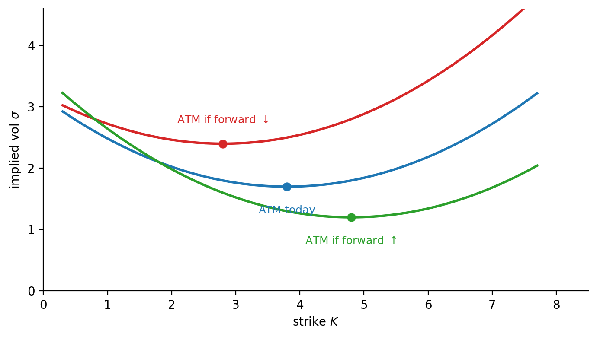
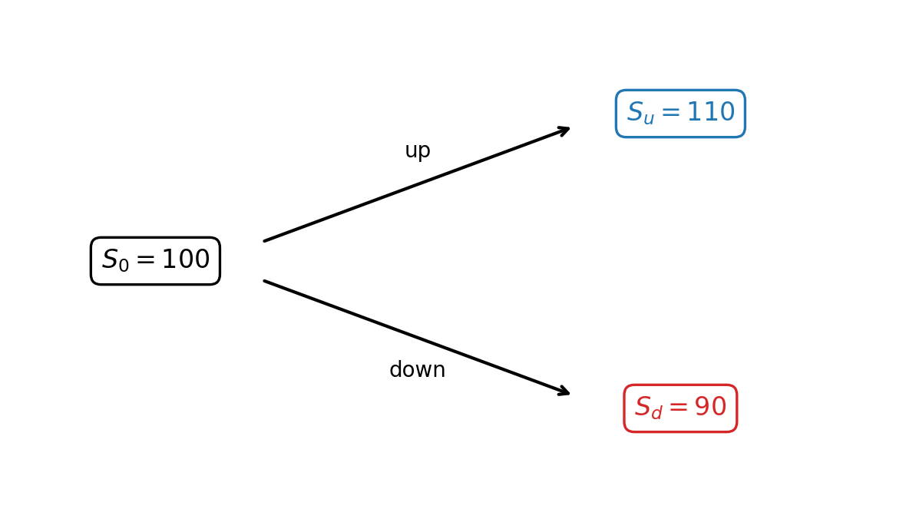
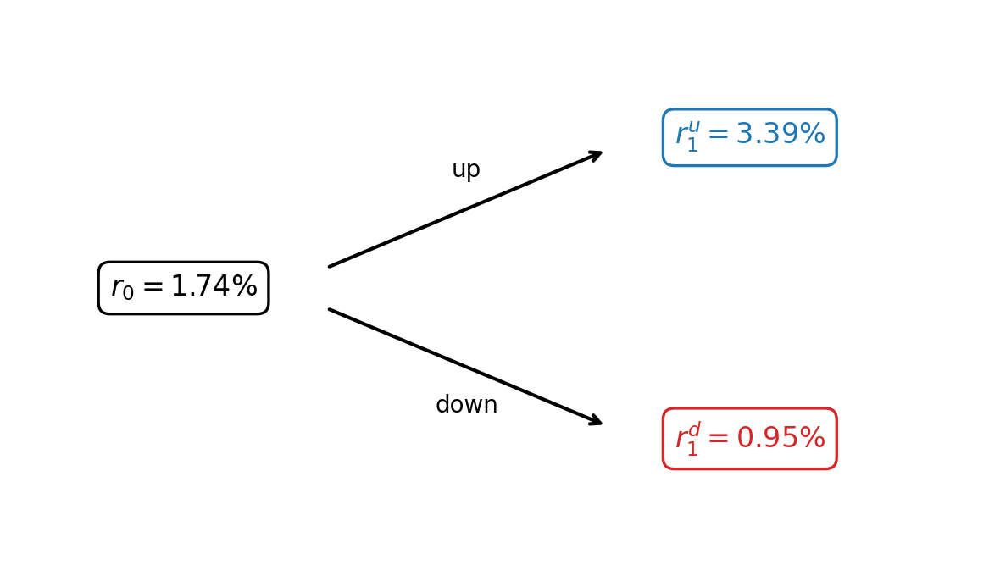
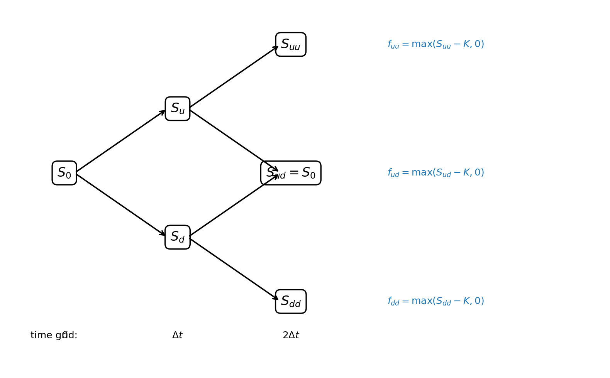

<!-- AUTO-GENERATED by scripts/convert.py — do not edit. -->

The lecturer opened the final session of the course in two halves. The
first hour finished a thread that had been running since Lecture 7:
the *volatility skew*, viewed through one last empirical case
study in which SABR is fit to options on *futures* contracts ---
SOFR futures, Treasury futures, crude oil, gold, equity index,
natural gas --- and used to predict how the implied-vol skew shifts
when the underlying moves. After a short break, the lecturer pivoted
to the second half of the session: a compressed introduction to
**numerical option pricing** in the form of *binomial trees*,
both for equities and, more importantly for our purposes, for
*interest-rate* derivatives. The closing slides walked through
the same machinery applied to floors, swaptions (European and
American), bonds, and callable bonds inside a worked notebook ---
how a rate tree, once calibrated, prices essentially every product
the course has touched.

The structural picture the lecturer wanted in our heads by the end
of this final lecture is two-fold. First, that SABR is a desk's
*dynamic* model, not just a static curve fit: SABR's statement
"when the forward rate moves down, the implied vol moves up" is a
testable hypothesis about market behaviour, and it is the reason a
fixed-income market-maker chooses SABR over Black for hedging.
Second, that the entire fixed-income derivatives stack we have built
--- caps, floors, swaptions, callable bonds, mortgage-backed securities
--- can be priced inside one numerical framework: a rate tree
calibrated to today's term structure and today's caplet vols, with
backward induction along the tree handling all the optionality. The
course's three-week buildup of Black, the bootstrap, the swap-rate
formula, and the SABR skew all point at one thing in production
--- a tree (or, in the next-level course, a continuous model like
Black--Derman--Toy or LIBOR Market Model) that ties all of those
prices together.

Programmatic note: this was an *abbreviated* chapter. The
lecturer's framing was that numerical methods would in any responsible
treatment fill an entire 100-unit course (FinMath 320 covers them in
depth). What we present here is a survey: enough machinery to
*recognize* a binomial tree, *operate* one for a
fixed-income payoff, and see why it sits exactly where the course
needs it. The Chapter 9.0 "overview" page was deliberately skipped
by the lecturer ("that chart is actually an old version, I'll fix
that"); these notes follow that judgment.

# SABR for futures: case study {#L8-sec:sabrfutures}

The lecturer reopened the SABR thread with a case study --- "case 8"
in the project numbering --- run on options for a panel of futures
contracts, observed at distinct dates in 2025. Three things made it
useful: it picked products with very different vol skew shapes
(SOFR and Treasury futures versus crude versus gold versus the
S&P 500 index option), it ran the SABR fit *day-over-day*
across many dates so we could see how the fitted parameters move,
and it tested SABR's *predictive* content against actual
day-over-day movements of the implied-vol skew --- not just its
ability to fit a single day's curve.

## Why this is a case study, not a project {#L8-sec:caseornot}

:::{.callout-important title="Key concept"}

**Cell (Page *SABR Skews for Futures* --- Estimation).**
*(What the case study does.)*\
For each futures contract and each business date in a panel of 2025
dates, fit a SABR model to that day's option chain. Track the fitted
parameters $(\alpha, \rho, \nu)$ across dates, with $\beta$ either
fixed (say at $\beta = 0.7$) or chosen via cross-validation. Plot the
implied-vol-vs-strike curve on each date and compare against the
actual market dots; plot the SABR-predicted day-over-day changes in
the curve against the actual changes; report fit quality (correlation
of predicted-vs-actual ATM vol changes, mean-squared skew error).

:::

The lecturer wanted us to internalize the *role* this exercise
plays in the course before any results were on the screen. SABR is
not being tested here as a way to make money. It is being tested as
a *coherent quoting and hedging system*. The market-maker's job
is to be ready to quote *at every strike, for every contract,
on every day*, and to know how the curve will move when the
underlying moves so that today's hedge does not blow up tomorrow.
That second piece --- the "Vega channel" the lecturer kept calling
out in Lecture 7 --- is what differentiates SABR from a static
flat-Black world. The case study probes whether SABR delivers it
empirically.

## The skew across futures markets {#L8-sec:skewacross}

Before the SABR fit, the lecturer reminded the class what the
implied-vol-vs-strike charts look like across the products in the
panel. The class had walked through these in Lecture 7's first
section; the lecturer's purpose in revisiting them was to set up
which markets are SABR's natural home and which are not.

:::{.callout-important title="Key concept"}

**Empirical pattern across futures markets.**

- **Crude oil (CL).** Pronounced upward smile/skew.
  "Bigger shocks are towards the upwards."

- **S&P 500 index (SPX).** Negative-slope skew (the
  classical equity skew --- low strikes priced more dearly
  than high strikes).

- **SOFR / 3-month STIR (SR3).** Roughly
  symmetric smile, often closer to flat in normal-vol terms.

- **10-year Treasury futures (TY).** Mild smile/skew.

- **Gold (GC), natural gas (NG).** Each has its own
  idiosyncratic shape; gold tends to a moderate smile, gas a
  steep skew driven by storage and seasonality.

The shapes do not fall onto one common pattern. The empirical
question SABR addresses is *whether the dynamics* are
common --- not whether every curve looks the same.

:::

The lecturer emphasized that the static curve shape is not the
interesting question. "It's not, look at how good the SABR fit is
to the curve. That's not the test of SABR. The test of SABR is, are
the dynamics it implies the right dynamics?" That framing pointed
us at the next slide.

## The negative-slope between forward and ATM vol {#L8-sec:negslope}

:::{.callout-important title="Key concept"}

**Cell 22 (Page *SABR Skews for Futures* --- Vol Path).**
*(SABR's empirical signature: forward $\downarrow$ implies
implied vol $\uparrow$.)*\
Pick one product (say SOFR futures, expiry roughly one year out) and
on every observation date plot the pair
$$\bigl(\,\text{forward rate today},\ \text{ATM Black implied vol today}\,\bigr).$$
Connect the dots in calendar order. SABR's stochastic-vol mechanics
predict that points trace out a *negatively-sloped* cloud:
when the forward rate goes down, the ATM implied vol typically goes
up.

:::

This cell was the centerpiece of the case study and the lecturer
spent several minutes on it. The intuition is the one we built up
in Lecture 7. SABR has a stochastic component: the underlying
volatility itself wiggles, and SABR's correlation parameter $\rho$
ties those wiggles to moves in the forward. Empirically, $\rho$ is
estimated negative for rate products --- a fall in the forward is
correlated with a rise in vol. That is not a definition; it is
something the data tells us about the cross-correlation in this
market, fit through SABR's machinery.

:::{.callout-tip title="Filling the gap"}

**Filling the gap.** The lecturer dropped "Saber thinks there's
a negative relationship between the forward rate and the vol" as if
self-evident. The mechanism inside SABR is: under the SABR dynamics
the forward $F$ and stochastic vol $\alpha$ co-evolve as
$$dF \;=\; \alpha\,F^{\beta}\,dW^{F},
  \qquad
  d\alpha \;=\; \nu\,\alpha\,dW^{\alpha},
  \qquad
  dW^{F}\,dW^{\alpha} \;=\; \rho\,dt,$$
so the instantaneous correlation between $F$ and $\alpha$ is exactly
$\rho$. With $\rho < 0$ (the empirical estimate for SOFR and other
rate products), a negative shock to $F$ comes with a positive shock
to $\alpha$ --- the curve we plot trends down-and-up. The
lognormal-skew $\beta < 1$ adds a second channel (low rates inflate
the local volatility $\alpha F^{\beta}/F$ in lognormal-equivalent
units), but the dominant signal in the plot is $\rho$.

:::

The empirical scatter the lecturer showed had a clear negative
slope. "We see exactly the kind of relationship Saber is being
helpful here... as you increase, this thing's going to drop."
The fit quality on day-over-day predicted-vs-actual ATM vol changes
came in at roughly $80\%$ correlation in the case study, with the
*scaling* of the predicted moves a bit off (the lecturer's
qualitative read: SABR's predicted slope is steeper than the actual
slope, but the sign and timing are right). "Don't take them quite
so seriously on the exact scaling. But they really are lining up
quite well in the correlation."

## Comparative-static interpretation: "which curve do I move along?" {#L8-sec:compstat}

The lecturer drew the comparative-static picture explicitly.

:::{.callout-important title="Key concept"}

**Comparative static.** Draw three implied-vol-vs-strike
curves: the original (blue), the SABR-shifted curve when the
forward goes *down* (red, sitting higher overall and shifted
left), and the SABR-shifted curve when the forward goes *up*
(green, lower and right). Mark today's ATM as the blue dot;
tomorrow's ATM as the red or green dot, sitting at a *different
strike* on a *different* curve.

::: center

:::

:::

The lecturer's point: "If I pull up my Bloomberg screen on ATM vol,
it's going to have jumped not from here to here vertically, it's
going to have jumped from the blue dot to the green dot." The
journalist headline ("ATM vol fell today") fuses two distinct
things: where on the strike axis ATM is today, and which curve we
are sitting on. SABR makes that fusion explicit and sometimes
predicts that on *your* inventory --- which is at a fixed strike,
not at ATM --- vol *rose* even when the headline ATM number
fell. "On my inventory, I'm going here from blue to orange. But if
I'm just taking the vol path, that headline number, I'm going from
where blue intersects the solid black to where orange intersects the
kind of dotted line."

## Where SABR is the natural choice, and where it isn't {#L8-sec:whererates}

A student asked the natural follow-up: *why* does SABR work
better for fixed-income derivatives than for, say, crude oil or
equities? The lecturer's answer was empirical, not theoretical:

> *Lecturer:* "Is there a theoretical reason that SABR works
> better for fixed income derivatives than, for example, crude oil or
> equities? Or is it just empirically observed? ... It is largely
> empirically observed. The choice of model in any of these markets
> is made knowing how that market empirically tends to behave. For
> equities, you see a lot of mean-reversion in volatility and the
> implied-vol surface, so Heston-type models tend to dominate. SABR
> can be used on equities, but it's not done much. SABR is the
> workhorse for fixed-income derivatives because that's where the
> empirical dynamics --- the $\rho < 0$ correlation, the $\beta$ near
> $0.7$, the moderate $\nu$ --- happen to fit best. Sometimes useful
> for FX. Mostly a curve-fitting tool for crude."

:::{.callout-important title="Key concept"}

**The market-by-market verdict.**

- **SOFR / Treasury / swaptions:** SABR is the market
  standard. Both static skew and dynamic skew-shifting predict
  well.

- **FX options:** SABR is sometimes used; alternatives
  include Vanna-Volga and stochastic-vol-with-jumps models.

- **Equities (SPX, ES):** SABR rarely used; Heston and
  local-vol-Heston blends dominate. Vol skew has too much
  mean-reversion structure for SABR's three parameters.

- **Crude oil:** SABR is sometimes fit for the curve
  shape but lecturer would not endorse the implied dynamics.

The principle: *the modeling choice is calibrated to the
empirical regularities of the market*, not derived from first
principles.

:::

## The April 2025 SOFR-futures observations {#L8-sec:apr25}

The lecturer chose April 2025 as the case-study window because of
the tariff news cycle that month --- a window where rates
expectations were jumping around enough to test SABR's dynamic
content. "I was just interested in whether we'd see something
here."

:::{.callout-important title="Key concept"}

**Cell 25 (Page *SABR Skews for Futures* --- Other Assets).**
*(How the comparison was structured.)*\
For each business date in April 2025, fit SABR to that day's option
chain. Then compute the day-over-day change predicted by SABR
(based on the realized change in the forward rate and SABR's fitted
parameters from the prior day). Compare against the actual day-over-
day change. Report the cross-correlation of predicted-vs-actual
across the date panel and across strikes.

:::

The headline result the lecturer presented: predicted-vs-actual
correlation of about $80\%$, slope-coefficient on a regression of
actual on predicted of around $0.6$ to $0.7$ rather than $1$. So
SABR captures the direction and a substantial chunk of the day-to-day
dynamics, but the magnitude is over-predicted. "If you let me just
fit my own line through here, it would say, take the SABR
predictions. Don't take them quite so seriously on the exact
scaling. But they really are lining up quite well in the
correlation."

## The fit-grid and the case-study questions {#L8-sec:fitgrid}

:::{.callout-important title="Key concept"}

**Cell 27 (Page *SABR Skews for Futures* --- code).**
*(The estimation loop.)*\
For each date $i$ in the panel and each $\beta$ on a small grid
$\{0.5, 0.7, 0.9\}$, call

::: center
`sabr_volpaths(LOADFILE, i, ISCALL, beta, date_t, shiftsize)`
:::

and stash the per-day fitted $(\alpha, \rho, \nu)$ and the residual
fit metric. Iterate over strikes for the predicted-vs-actual table.

:::

The lecturer flagged *three* layered choices the case study
deliberately avoids resolving. Most narrowly, what value of $\beta$
to fix --- $0.5$, $0.7$, $0.9$? The data weakly prefers something in
the middle but does not pin it down. Stepping out, is one day's
SABR fit representative? On some days the fitted $\rho$ is sharply
negative, on others nearly zero. Stepping out further, is SABR even
the right model for the product? The case study answers the third
question only for SOFR (yes) and rules it out for equities; the
others are left as "it depends."

After the SABR-for-futures case the lecturer paused for a 12-minute
break and then turned to the second half of the lecture: numerical
methods.

# Numerical methods: where binomial trees fit {#L8-sec:nmframe}

The lecturer opened Chapter 9 with an explicit caveat about scope.
"This session, Chapter 9, is meant to be somewhat shorter because
it's really opening up things that would take a whole course... I'm wary of doing anything where we just do a worse, faster version
of what we do in FinMath 320." The chapter therefore reads as a
*landmark tour* rather than a self-contained development. Three
families of methods sit on the option-pricing pricing menu:

:::{.callout-important title="Key concept"}

**The pricing-method menu.**

::: center
  **Dynamics**         **Contract structure**   **Method**
  -------------------- ------------------------ -------------------------
  simple (lognormal)   vanilla European         closed form (Black)
  simple               American / Bermudan      *tree*
  complex (jumps)      vanilla                  finite difference / FFT
  complex              path-dependent           Monte Carlo
:::

:::

The lecturer wanted us to remember that trees occupy a specific
quadrant: *simple* dynamics (essentially still log-normal, with
the diffusion approximated discretely) but *complex* contract
structure --- the early-exercise feature of an American option,
the issuer's call right inside a callable bond, the prepayment
optionality in a mortgage-backed security. For everything in this
quadrant the tree's backward-induction algorithm handles optionality
"for free" at each node. We will not in this lecture build the
machinery for jumps or path-dependent payoffs --- those are FinMath
320's territory --- but we will see the entire tree mechanic for the
fixed-income case.

:::{.callout-tip title="Filling the gap"}

**Filling the gap.** "Why a *tree* for an American option,
and why does Black not work?" Black's formula assumes the holder
exercises optimally at expiration $T$ and only at $T$ --- the value
of the option is $Z(0,T)$ times the risk-neutral expectation of the
terminal payoff. An American option lets the holder exercise at any
date $t \le T$. At each $t$, the option's value is
$$V_t \;=\; \max\bigl(\,\text{intrinsic value at }t,\ \text{continuation value at }t\,\bigr),$$
where "continuation value" is the discounted risk-neutral
expectation of $V_{t+\Delta t}$. There is no closed form for this
recursion in general --- but *a tree solves it node by node,
backward in time, exactly*. That is the algorithmic contribution.

:::

## What this lecture will not cover {#L8-sec:notcover}

:::{.callout-important title="Key concept"}

**Out of scope (and which course covers each).**

- Calibration of an arbitrage-free rate tree to today's
  discount curve *and* caplet vols simultaneously --- the
  full "Black--Derman--Toy" or "Ho--Lee" algorithm. (FINM
  37500 / FinMath 320.)

- Continuous-time short-rate models (Vasicek, CIR, Hull--White)
  and their tree counterparts. (FinMath 330.)

- LIBOR Market Model / SABR-LMM in practice. (FINM 37500 in a
  hypothetical 100-unit version.)

- Monte Carlo for path-dependent fixed-income payoffs.
  (FinMath 320.)

- Trinomial trees and explicit finite-difference schemes.
  (FinMath 320.)

:::

The lecturer wanted us to leave the lecture knowing what we don't
yet know, so that an exam answer or a desk question that wanders into
this territory triggers the right "out of scope" flag rather than
a guess.

# The equity binomial tree (one period) {#L8-sec:eqone}

The lecturer set up the binomial tree on the simplest example: a
single period, zero interest rate, two states. The deliberate choice
was to make the algebra trivial so that the *logic* of
replication is in the foreground, not the bookkeeping.

## The setup {#L8-sec:setup}

:::{.callout-important title="Key concept"}

**Cell (Page *Intro to Binomial Trees*, Setup).**
*(One period of uncertainty: $t = 0$ and $t = T$, no trading
in between, zero interest rate, stock either up or down.)*

::: center

:::

**The contract:** European call, strike $K = 105$, expiration $T$.
$$C_u \;=\; \max(S_u - K, 0) \;=\; \max(110 - 105, 0) \;=\; 5,$$
$$C_d \;=\; \max(S_d - K, 0) \;=\; \max(90 - 105, 0) \;=\; 0.$$
We do not assume any probability for the up-move. We will price $C_0$
without using one.

:::

The lecturer's framing here was deliberate. "Notice we have not
talked about the probability of the up move. We will not need it.
This is the punchline of the binomial tree the same way it was the
punchline of Black's formula." The setup is structured so that
no-arbitrage replication will pin down the call price uniquely, with
no statement about how likely up is.

## The hedge ratio {#L8-sec:hedge}

:::{.callout-important title="Key concept"}

**Hedge ratio (delta).** The number of shares of stock that
moves dollar-for-dollar with the call across the two states is
$$\Delta \;=\; \frac{C_u - C_d}{S_u - S_d}.$$
Plugging in the numbers:
$$\Delta \;=\; \frac{5 - 0}{110 - 90} \;=\; \frac{5}{20} \;=\; 0.25.$$

:::

The lecturer pushed the class to feel why this is the right number
before deriving anything. "If the stock moves \$20 between up and
down, and the option moves \$5, then \$1 of stock is worth a quarter
of a dollar of option in this discrete world. So $0.25$ shares of
stock matches one short call." The hedge ratio is the "coverage
ratio" for moving dollar-for-dollar with the call.

:::{.callout-tip title="Filling the gap"}

**Filling the gap.** Why does the formula above give the
*unique* hedge ratio that makes a long-stock-short-call
position riskless across the two states? Set up the riskless
condition explicitly. Suppose we hold $\Delta$ shares of stock and
short one call. The portfolio value at $T$ is
$$V_u \;=\; \Delta\,S_u - C_u, \qquad V_d \;=\; \Delta\,S_d - C_d.$$
Riskless means $V_u = V_d$:
$$\Delta\,S_u - C_u \;=\; \Delta\,S_d - C_d
  \quad\Longleftrightarrow\quad
  \Delta\,(S_u - S_d) \;=\; C_u - C_d
  \quad\Longleftrightarrow\quad
  \Delta \;=\; \frac{C_u - C_d}{S_u - S_d}.$$
That is the unique hedge ratio that turns the two-state portfolio
into one number across both branches.

:::

## Replicating the call: portfolio composition {#L8-sec:replicate}

With $\Delta = 0.25$, we go long $0.25$ shares of stock and short
one call. The terminal portfolio value is the same in both states:

:::{.callout-important title="Key concept"}

**Cell 7 (Page *Intro to Binomial Trees*, Replicating
Cash).**
$$\begin{align*}
  \text{UP:}\quad   V_u &\;=\; (0.25)(110) - 5 \;=\; 27.5 - 5 \;=\; 22.5, \\
  \text{DOWN:}\quad V_d &\;=\; (0.25)(90)  - 0 \;=\; 22.5 \;=\; 22.5.
\end{align*}$$
The portfolio pays \$22.50 at $T$ in both states. With the interest
rate at zero, the present value of this guaranteed cashflow is
\$22.50.

:::

## Pricing by no-arbitrage {#L8-sec:pricena}

Now use no-arbitrage. The cost of setting the portfolio up at
$t = 0$ must equal its (deterministic) terminal value of \$22.50
(with $r = 0$, the discount factor is $1$). Writing the cost in
terms of the position sizes,
$$V_0 \;=\; \Delta\,S_0 - C_0
       \;=\; 0.25 \cdot 100 - C_0
       \;=\; 25 - C_0,$$
and setting $V_0 = 22.5$ solves for the call's price:
$$C_0 \;=\; 25 - 22.5 \;=\; 2.50.$$

The lecturer dwelt on the no-arbitrage move. "Why must the cost of
setting up this portfolio equal \$22.50? Because the portfolio's
final payoff is \$22.50 with certainty, in either state. If you
could buy the portfolio for less than \$22.50, you would lock in a
risk-free profit of (\$22.50 minus what you paid). If you could
short the portfolio for more than \$22.50, you would short at the
high price, repay \$22.50 at $T$, and pocket the difference. Since
neither arbitrage exists, the cost is forced to be \$22.50." That
is the entire pricing argument; the algebra solves for $C_0 = 2.50$.

# The risk-neutral interpretation of $p^*$ {#L8-sec:rnpstar}

The same answer falls out of a re-interpretation that will scale to
multiperiod trees and to interest-rate trees: the risk-neutral
formulation.

## The pricing formula {#L8-sec:priceformula}

:::{.callout-important title="Key concept"}

**Cell 13 (Pricing Formula).**
The cost of setting up the riskless portfolio is $S_0\,\Delta - C_0$
and its present value of the guaranteed payoff is $S_u\,\Delta - C_u$
(any state would do --- they are equal). Setting them equal and
solving for $C_0$:
$$C_0 \;=\;
    C_u\,\underbrace{\,\frac{S_0 - S_d}{S_u - S_d}\,}_{p^*}
    \;+\;
    C_d\,\underbrace{\,\frac{S_u - S_0}{S_u - S_d}\,}_{1 - p^*}.$$
The numbers $p^*$ and $1 - p^*$ depend only on the stock-tree
geometry $(S_0, S_u, S_d)$, not on $K$ or any payoff. With our
numbers, $p^* = (100 - 90)/(110 - 90) = 0.5$, and indeed
$0.5 \cdot 5 + 0.5 \cdot 0 = 2.5$.

:::

:::{.callout-tip title="Filling the gap"}

**Filling the gap.** The algebra from the riskless equality
$S_0\,\Delta - C_0 = (S_u\,\Delta - C_u)\,Z$ where $Z$ is the
discount factor and $\Delta = (C_u - C_d)/(S_u - S_d)$. Substituting,
$$S_0\,\frac{C_u - C_d}{S_u - S_d} - C_0 \;=\; Z\Bigl[S_u\,\frac{C_u - C_d}{S_u - S_d} - C_u\Bigr],$$
and rearranging for $C_0$, multiplying through and grouping the $C_u$
and $C_d$ terms separately, gives
$$C_0 \;=\; Z\Bigl[\,C_u\,\frac{S_0/Z - S_d}{S_u - S_d}
                  + C_d\,\frac{S_u - S_0/Z}{S_u - S_d}\,\Bigr].$$
With $r = 0$, $Z = 1$ and we get the displayed formula. With $r \ne 0$,
$Z = e^{-r\,\Delta t}$ and the inside fractions become
$p^* = (A\,S_0 - S_d)/(S_u - S_d)$ where $A = e^{r\,\Delta t}$. The
algebra is mostly bookkeeping; what matters is that $C_0$ is a
discounted weighted average of $C_u$ and $C_d$ with weights that
*do not depend on the call's payoffs*.

:::

## Three ways to read $p^*$ {#L8-sec:threereads}

:::{.callout-important title="Key concept"}

**Cell 16 (Probability interpretation).**
Read $p^*$ as a "probability" of the up-state. Then
$$C_0 \;=\; p^* \cdot C_u + (1 - p^*)\cdot C_d \;=\; \E^{*}[C_T],$$
where $\E^{*}$ is expectation under that probability. With our
numbers, $p^* = 0.5$, $C_0 = \E^{*}[C_T] = 0.5 \cdot 5 + 0.5 \cdot 0 = 2.5$,
which is exactly the price.

:::

The lecturer was emphatic: $p^*$ is *not* the true probability
of the up-state. "We never used the true probability anywhere in
this derivation. The $p^*$ falls out of the geometry of the stock
tree --- $S_0$, $S_u$, $S_d$ --- via no-arbitrage. We *label*
it a probability because the formula has the shape of an expected
value, and that label is going to be a powerful organizing device.
But $p^*$ is a pricing object, not a forecast."

:::{.callout-important title="Key concept"}

**Cell 17 (State-contingent payoffs).**
A second reading: define $U$ and $D$ to be the time-zero prices of
*state-contingent claims* that pay \$1 in the up state and \$0
otherwise (and vice versa). Any payoff $f$ at $T$ is a portfolio of
$U$'s and $D$'s:
$$f(\omega) \;=\; f_u\cdot \mathbf{1}_{\{\omega = u\}} + f_d \cdot \mathbf{1}_{\{\omega = d\}}.$$
Its time-zero price is therefore $f_u \cdot P_U + f_d \cdot P_D$,
where $P_U$ and $P_D$ are the prices of $U$ and $D$. In the zero-rate
single-period example, $P_U = p^*$, $P_D = 1 - p^*$, recovering
the formula.

:::

## Key features of the binomial pricing solution {#L8-sec:keyfeatures}

:::{.callout-important title="Key concept"}

**Cell 18 (Key features).**

- We priced the call without ever knowing the actual tree
  probabilities.

- In this simple tree, "not knowing the true probabilities"
  is equivalent to "not knowing the stock's drift" --- the
  call's price is independent of the drift.

- The hedge ratio $\Delta$ is constructive: it tells us the
  portfolio that replicates the call.

- Replication ties the price to existing tradeables ($S$ and
  cash), not to a model.

:::

The lecturer emphasized the independence of price from drift as
the binomial-tree analogue of Black's most counterintuitive result.
"Black's formula doesn't have $\mu$ in it. Why? For exactly the
same reason this tree doesn't need the up-probability: the
replication argument doesn't care what you think the drift is. You
either replicate the option or you don't. If you do, the price is
pinned down by what you can already trade."

# Generalizing the binomial tree {#L8-sec:general}

The lecturer next walked through the upgrades needed to take this
single-period zero-rate equity tree and turn it into a usable
machine. Each upgrade is small; the cumulative effect is a tree
that handles real-world derivatives.

## General notation {#L8-sec:gennotation}

:::{.callout-important title="Key concept"}

**Cell 22--25 (General notation).**
For a generic underlying $S$ over a time interval $\Delta t$,
$$S_u \;=\; u\,S_0,
  \qquad
  S_d \;=\; d\,S_0,$$
with $u > 1 > d > 0$ multiplicative "up" and "down" factors. The
derivative price is denoted $f$ (call, put, or any other contract).
The continuously compounded interest rate over $\Delta t$ is $r$, and
$$Z \;=\; e^{-r\,\Delta t}, \qquad A \;=\; e^{r\,\Delta t}, \qquad Z = 1/A.$$
The risk-neutral up-weight becomes
$$p^* \;=\; \frac{A - d}{u - d},$$
and the no-arbitrage pricing formula becomes
$$f_0 \;=\; Z\Bigl[\,p^*\,f_u + (1 - p^*)\,f_d\,\Bigr].$$

:::

The form is identical to the zero-rate case except for the discount
factor $Z$ in front and the $A = e^{r\,\Delta t}$ growth factor inside
$p^*$. "All we did was put discounting back in. Nothing structural
changed."

## Setting $u$ and $d$: matching volatility {#L8-sec:vol}

The next question is parametric: how do we choose $u$ and $d$? The
lecturer's slide gave the standard answer:

:::{.callout-important title="Key concept"}

**Cell 30 (Setting $u$ and $d$ via volatility).**
The variance of one step (a Bernoulli with up-probability the true,
*not risk-neutral*, probability) is computed in
log-returns. Match it to the variance of a continuous-time
log-normal process with volatility $\sigma$ over $\Delta t$:
$$\Var\bigl(\,\ln(S_T/S_0)\,\bigr) \;=\; \sigma^2 \,\Delta t.$$
The Cox--Ross--Rubinstein (CRR) choice that solves this with
$ud = 1$ is
$$u \;=\; e^{\sigma\sqrt{\Delta t}},
  \qquad
  d \;=\; e^{-\sigma\sqrt{\Delta t}}.$$

:::

:::{.callout-tip title="Filling the gap"}

**Filling the gap.** Why $ud = 1$ as a side-condition, and why
that closed form? Two equations are needed to pin down $u$ and $d$:
volatility match (one equation) plus a symmetry condition (the
second). $ud = 1$ is the recombining-tree condition --- after one
up and one down, the tree returns to $S_0$ --- which keeps the
multiperiod tree small (size grows linearly with depth, not
exponentially). With $ud = 1$, $d = 1/u$. Substituting into the
volatility-match equation and solving gives the
$u = e^{\sigma\sqrt{\Delta t}}$, $d = e^{-\sigma\sqrt{\Delta t}}$
formulas above. Other choices --- Jarrow-Rudd, Tian's --- correspond
to different second conditions and different $u$, $d$ pairs, but
CRR is the standard for fixed-income work.

:::

## Adjusting $A$ for dividends and futures {#L8-sec:adjustA}

:::{.callout-important title="Key concept"}

**Cell 31 (Other settings).**
The growth factor $A$ depends on what the underlying is:
$$A \;=\;
    \begin{cases}
      e^{r\,\Delta t} & \text{non-dividend stock,} \\
      e^{(r - q)\,\Delta t} & \text{stock with continuous dividend yield } q, \\
      1               & \text{futures contract,} \\
      e^{(r - r_f)\,\Delta t} & \text{currency, with foreign rate } r_f.
    \end{cases}$$
The pricing recursion $f_0 = Z\,[\,p^* f_u + (1-p^*) f_d\,]$ is
unchanged --- only the input $A$ inside $p^*$ shifts.

:::

The futures case is the one we will need for SOFR-futures option
pricing. "Futures contracts have no carrying cost, so the expected
move under the risk-neutral measure is zero --- $A = 1$. Plug
$A = 1$ into $p^* = (A - d)/(u - d) = (1 - d)/(u - d)$ and the rest
of the machinery is unchanged."

## Two concerns: market incompleteness and time discretization {#L8-sec:concerns}

:::{.callout-important title="Key concept"}

**Cell 32 (Concerns).**

- **Market incompleteness from discretization of space.**
  With only two states, every claim is replicable by the
  riskless portfolio of $S$ and cash. With three or more
  states, the same machinery breaks: not every payoff is
  replicable, $p^*$ is not unique, and no-arbitrage gives a
  *range* of consistent prices, not a single price.

- **Time discretization.** The continuous-time process
  is being approximated by a discrete tree. As $\Delta t \to 0$
  with the volatility-matching $u, d$, the tree's distribution
  of $\ln S_T$ converges to the lognormal --- but at any
  finite $\Delta t$, it is an approximation.

:::

The lecturer let the second concern pass quickly --- "in practice
you take 30 steps for a vanilla American, more for an exotic, the
convergence is fine." The first concern is the deeper one and
deserves a tipblock.

:::{.callout-tip title="Filling the gap"}

**Filling the gap.** What does "three states break replication"
mean concretely? Suppose the stock can go to $S_u$, $S_m$, $S_d$
with $S_d < S_m < S_u$, and we want to price a call. We have two
tradeables (stock and cash) and three states. The hedge equation
$\Delta\,S_x - C_x = V$ (with $V$ a constant) is one equation per
state, three in total, but only two unknowns ($\Delta, V$ together
with the requirement that the cost-of-setup match). Three equations,
two unknowns: generically no solution. The market-completeness
condition for replication is
$$\#\{\text{tradeable assets}\} \;\ge\; \#\{\text{states}\}.$$
A trinomial tree therefore is *incomplete* unless one adds a
third tradeable (a second option, the bond market, etc). Pricing
inside a trinomial requires a richer machinery: a market price of
risk, or an explicit choice of the third tradeable.

:::

# From equities to interest rates {#L8-sec:rateequities}

The lecturer's next move was the one fixed-income students need to
internalize for the rest of the class. "Apply the same principles
to a case where the underlying tree is not a traded security, but
rather *interest rates*."

## Why this is more delicate {#L8-sec:moredelicate}

:::{.callout-important title="Key concept"}

**The crucial twist.** The interest rate $r$ is *not*
itself a traded security. It is a quantity the bond market lets us
infer (via the discount curve), but you cannot "buy a unit of the
short rate" the way you can buy a share of stock. The replication
argument therefore needs a substitute for "stock" --- and the
substitute is *bonds of various maturities*.

:::

The lecturer's framing: "In the equity tree we replicated the call
using stock and cash. In the rate tree we will replicate the rate
option using a 1-period bond and a 2-period bond. The 1-period
bond plays the role of cash --- it pays a known amount at time
$\Delta t$. The 2-period bond plays the role of stock --- its time-
$\Delta t$ price is uncertain because rates have moved."

## Setup: the rate tree {#L8-sec:ratetree}

:::{.callout-important title="Key concept"}

**Cell 33--37 (Rate tree setup).**
Use $\Delta t = 0.5$ years (six-month tree step). At each node,
the rate is the continuously-compounded six-month rate prevailing
between the current node and the next. Equivalently, this is

- the discount rate over the period, or

- the YTM on a six-month zero-coupon bond starting at the
  node.

::: center

:::

**Quotes used to build the tree.**

::: center
   **maturity (yrs)**   **price (per \$100)**   **YTM**
  -------------------- ----------------------- ----------
         $0.5$                 $99.13$          $1.74\%$
         $1.0$                 $97.89$          $2.13\%$
         $1.5$                 $96.15$          $2.62\%$
:::

:::

The numbers are deliberately small (only three nodes, only one
period of uncertainty) so the algebra in a moment is clean. The
key is that we have *two bonds* (1-period maturing at
$\Delta t = 0.5$ and 2-period maturing at $1.0$) and *two
states* of the rate at $\Delta t$.

## Why continuously compounded? {#L8-sec:contcompound}

:::{.callout-important title="Key concept"}

**Cell 40 (Why continuous compounding).**
"This is miles vs kilometers, not a modeling choice. There is a
one-to-one mapping from continuous-compounding to any other
compounding convention. As we change the time-step of the tree, we
do not want to change all the compounding rates. The continuously-
compounded form is invariant to $\Delta t$ --- the same $r_0$
multiplies the same $\Delta t$ regardless of whether we cut the
tree into $0.5$-year or $0.25$-year steps. This will converge to
the continuous-time short-rate model as $\Delta t \to 0$."

:::

The lecturer's point: a semi-annually-compounded rate would
need to be re-expressed every time we change $\Delta t$. With
continuous compounding the discount factor is always
$Z = e^{-r\,\Delta t}$ regardless of how finely we discretize, and
the limit as $\Delta t \to 0$ is exactly the continuous-time
short-rate model that fixed-income textbooks treat.

# Pricing a rate option (one period) {#L8-sec:rateoption}

## The contract {#L8-sec:contract}

:::{.callout-important title="Key concept"}

**Cells 42--44 (rate option).**
A simple interest-rate option, treated by analogy to a put on a stock:

- Payoff at period $1$ ($t = \Delta t = 0.5$).

- Strike rate $r_K = 2\%$.

- Payoff: $100 \cdot \max(r_K - r_1, 0)$ per \$100 face.

With the rate tree above, $r_1^u = 3.39\%$ and $r_1^d = 0.95\%$:
$$f_u \;=\; 100\cdot\max(0.02 - 0.0339, 0) \;=\; 0,
  \qquad
  f_d \;=\; 100\cdot\max(0.02 - 0.0095, 0) \;=\; 1.05.$$

:::

The contract is the simplest possible rate-floor-let: pay if the
rate falls below the strike. It will be the building block for the
floor-pricing exercise in Class 8.2.

## Replicating the rate option {#L8-sec:repl}

The crucial difference from the equity case: instead of replicating
with stock and cash, we replicate with the *1-period* bond and
the *2-period* bond.

:::{.callout-important title="Key concept"}

**Cells 45--50 (replication portfolio).**
Let $\alpha$ be the position in the 1-period bond and $\beta$ the
position in the 2-period bond. The 1-period bond is risk-free over
the step ($t = 0$ to $t = \Delta t$): it matures at \$100 face.
The 2-period bond's time-$\Delta t$ price is uncertain because it
still has one period left and the rate is now $r_1$:
$$P^{(2)}_u \;=\; 100/A^u \;=\; 98.32,
  \qquad
  P^{(2)}_d \;=\; 100/A^d \;=\; 99.53,$$
where $A^u = e^{r_1^u \,\Delta t}$ and similarly for $d$. Match the
call payoff state-by-state:
$$\alpha \cdot 100 + \beta \cdot P^{(2)}_u \;=\; f_u \;=\; 0,
  \qquad
  \alpha \cdot 100 + \beta \cdot P^{(2)}_d \;=\; f_d \;=\; 1.05.$$

:::

This is two equations in two unknowns. Subtracting the first from
the second:
$$\beta\,(P^{(2)}_d - P^{(2)}_u) \;=\; f_d - f_u
  \quad\Longleftrightarrow\quad
  \beta \;=\; \frac{f_d - f_u}{P^{(2)}_d - P^{(2)}_u}.$$
Plugging back into the first equation gives $\alpha$. Numerically:
$$\beta \;=\; \frac{1.05 - 0}{99.53 - 98.32} \;=\; \frac{1.05}{1.21}
       \;\approx\; 0.868,
  \qquad
  \alpha \;=\; \frac{f_u - \beta\,P^{(2)}_u}{100} \;\approx\; -0.853.$$

:::{.callout-tip title="Filling the gap"}

**Filling the gap.** Why does the 2-period bond play the role
of "stock" in this replication? Because its time-$\Delta t$ price
is uncertain. The 1-period bond is known (it matures and pays \$100).
The 2-period bond, by contrast, has one period of uncertainty left
in it; its price moves with the rate. So the analogy is:

::: center
  **Equity tree**     **Rate tree**                   **Role**
  ------------------- ------------------------------- ------------------
  stock $S$           2-period bond $P^{(2)}$         risky asset
  cash (constant 1)   1-period bond $P^{(1)} = 100$   riskless asset
  call $C$            rate option $f$                 contingent claim
:::

The replication algebra is structurally identical; only the
underlyings have changed.

:::

## Pricing by no-arbitrage {#L8-sec:rateprice}

:::{.callout-important title="Key concept"}

**Pricing the rate option.**
The cost at $t = 0$ of the replicating portfolio is
$$f_0 \;=\; \alpha \cdot P^{(1)}_0 + \beta \cdot P^{(2)}_0
       \;=\; \alpha \cdot 99.13 + \beta \cdot 97.89.$$
With $\alpha \approx -0.853$ and $\beta \approx 0.868$,
$f_0 \approx 0.34$ per \$100 face.

:::

## Risk-neutral check {#L8-sec:rncheck}

:::{.callout-important title="Key concept"}

**Cells 54--56 (risk-neutral pricing of the rate option).**
The risk-neutral probability satisfies (using the 2-period bond as
the underlying)
$$p^* \;=\;
    \frac{A\,P^{(2)}_0 - P^{(2)}_d}{P^{(2)}_u - P^{(2)}_d},$$
where $A = e^{r_0\,\Delta t}$. Once $p^*$ is computed, pricing any
contingent claim on the rate is the discounted risk-neutral
expectation:
$$f_0 \;=\; Z\bigl[\,p^* \,f_u + (1 - p^*)\,f_d\,\bigr].$$
The two routes (replication and risk-neutral) give the same price.

:::

## Independence from drift {#L8-sec:noDrift}

:::{.callout-important title="Key concept"}

**Cell 64 (true probability vs risk-neutral).**
By Girsanov's theorem the true expectation and the risk-neutral
expectation are linked by a Radon--Nikodym factor whose log-derivative
contains the *market price of (the underlying) risk*. The
crucial consequence: $f_0$ is independent of the true probability
of the up-state. The pricing equation depends only on the bond-
tree geometry $(P^{(2)}_0, P^{(2)}_u, P^{(2)}_d)$ via $p^*$ and on
the option payoffs $f_u, f_d$. We never needed to know the true
probability of the rate going up tomorrow.

:::

The lecturer was emphatic about this. "All of the discussion you
hear from the Fed and from the FOMC about whether rates are going
to go up tomorrow has *nothing* to do with the price of an
interest-rate derivative today. It only enters through what people
have already paid for the 2-period bond. Once that price is in,
the option's price is pinned down." This is the same drift-
independence we saw in the equity binomial and in Black: replication
arguments do not need the drift.

# The multiperiod tree {#L8-sec:multiperiod}

## Recap of the one-period structure {#L8-sec:oneprecap}

:::{.callout-important title="Key concept"}

**Cell 66 (Reminder).**
The one-period tree has handed us:

- A **replication argument**: build a portfolio of
  underlying tradeables that matches the option's payoffs in
  every state; the no-arbitrage cost equals the option price.

- A **risk-neutral interpretation**: the price is a
  discounted weighted average of the option's terminal
  payoffs with weights $p^*$, $1 - p^*$ derived from the
  underlying tree.

- A **drift-independence**: the answer does not depend
  on the true probabilities of the up- and down-states.

The same structure carries over to multi-period trees, applied
recursively.

:::

## Building the multiperiod tree {#L8-sec:multitree}

:::{.callout-important title="Key concept"}

**Cell 67--70 (multiperiod tree).**
Continue the equity tree to a second period:

- Apply $u$ and $d$ at every node so that
  $S_{0}\,uu \cdot ud \cdot du \cdot dd$ are the terminal
  states. With $ud = 1$ (CRR), the tree
  *recombines*: $S_0\,ud = S_0\,du = S_0$, so after one
  up and one down we are back at $S_0$. The tree at depth $n$
  has $n + 1$ terminal nodes (linear in depth, not
  exponential).

- Use the contract to compute the payoff at each terminal node.

- **Move backward.** At each penultimate node, run a
  one-period tree with the two children to get the option
  value at that node. "We have two separate, one-period
  trees. The solution procedure works exactly as discussed
  before --- same formulas, with the obvious adaptations.
  $f_{uu}$ and $f_{ud}$ instead of $f_u$ and $f_d$. $S_0\,uu$
  and $S_0\,ud$ instead of $S_u$ and $S_d$."

- Repeat until reaching the root.

:::

::: center

:::

The picture is the standard CRR recombining tree at depth $n = 2$.
At depth $n$ in general, the tree has $n + 1$ terminal nodes; the
total number of nodes (including all interior ones) is $\binom{n+2}{2}
= O(n^2)$. Backward induction at each interior node is one
"one-period tree" computation. So the total cost is also $O(n^2)$.

## Choosing the time grid {#L8-sec:timegrid}

:::{.callout-important title="Key concept"}

**Cell 73 (choosing $\Delta t$).**
The time grid must be fine enough for the discrete tree's terminal
distribution to approximate the continuous-time lognormal
distribution well enough for the contract.

- **Vanilla American:** around 30 steps is standard.

- **Bermudan / callable bonds:** 50--100 steps; the
  exercise dates need to align with tree time steps.

- **Exotic (barrier, knock-in):** hundreds of steps
  because the precise location of the barrier matters.

Too coarse $\Rightarrow$ the convergence error is large. Too fine
$\Rightarrow$ the computation slows down quadratically (depth $n$
gives $O(n^2)$ work for vanilla American payoffs, more for
path-dependent ones).

:::

## Specific underlying values: trinomial alternative {#L8-sec:trinomial}

:::{.callout-important title="Key concept"}

**Cell 74 (specific underlying values).**
The CRR tree does not let us hit a specific terminal stock price
on the grid. We choose $u$ and $d$ to match volatility, and the
terminal nodes land at $S_0\,u^k\,d^{n-k}$ for $k = 0, \ldots, n$ ---
which prices we cannot pre-select. For some payoffs (a barrier at
exactly $S = 110$, say) we want the grid to pass through that price
exactly. **Trinomial trees** give that flexibility: at each
node the underlying can go up, down, or stay flat, with the third
parameter giving an extra degree of freedom to fix the grid points.
The tradeoff is market incompleteness in the trinomial (recall the
three-states-not-replicable argument), addressed by adding a third
tradeable to the replication.

:::

# Using binomial trees in practice {#L8-sec:usingbintrees}

After the break the lecturer ran through the operational use of a
calibrated rate tree, walking through the same notebook page
(*Using Binomial Trees*) one cell at a time. The point of this
half-hour is not to derive new theory but to see the tree applied to
each fixed-income product the course has covered.

## The calibrated rate tree as a primitive {#L8-sec:ratetreeprim}

:::{.callout-important title="Key concept"}

**Cell 7 (Page *Using Binomial Trees*).**
*(The rate tree, displayed.)*\
`display_bintree_valuation(ratetree, refratetree, charttype=’df’, title=’Rates (compounding={freqcurve})’, fmt=’{:.1%}’)`\
The cell prints the rate tree as a triangular DataFrame: rows indexed
by tree node, columns indexed by time step. Each entry is the rate
prevailing in that state at that time. The lecturer emphasized that
this tree is the *primitive* for everything that follows.
"This is just a tree of three-month interest rates --- annualized.
Once I have this, I can price any rate-dependent payoff."

:::

The lecturer described the rate tree as "the universal language"
for the tree-based half of fixed-income derivatives: every product
in the rest of the lecture is built on this same tree. The tree was
calibrated to today's discount curve at the level (so that
1-period, 2-period, \... bonds price correctly) and to today's caplet
volatilities (so that the dispersion across rows matches Black's
implied vols). The full calibration recipe --- Black-Derman-Toy or
Ho-Lee --- is the FinMath 320 / FINM 37500 material flagged earlier.

## Pricing a floor on the rate tree {#L8-sec:floortree}

:::{.callout-important title="Key concept"}

**Cell 9 (Page *Using Binomial Trees*, floor).**
*(Pricing a 3-year, quarterly floor as a floorlet sum.)*

    SECURITY = 'floor'
    isPayer  = False
    T        = 3
    freq     = 4
    output = bintrees(SECURITY, ratetree, curves, T=T,
                      cffreq=freq, isPayer=isPayer,
                      cmpnd_ratetree=CMPND_RATETREE)

The function walks the tree backward, applying at each node the
floorlet payoff $\max(K - r_t, 0) \cdot \text{notional}$ when the
node is a reset date, then averaging weighted by $p^*$ and
discounting by the local rate.

:::

The lecturer's framing: "A floor is a bundle of floorlets. At each
quarterly reset date, the floor pays
$\max(K - r_t, 0)$ on a fraction of the notional. The tree handles
each floorlet as one mini-payoff at the right node, and the
backward induction sums them with the right discount factors. So
the floor's price comes out as one number at the root --- a
weighted average of all the floorlets' state-by-state payoffs."

:::{.callout-important title="Key concept"}

**The mechanics displayed.**
For each terminal-state node (each leaf), compute
$\max(K - r_{\text{leaf}}, 0)$. At each interior node, set
$$V_{\text{node}}
   \;=\; Z_{\text{node}}\Bigl[\,
              p^*\,V_{\text{up child}} \;+\; (1 - p^*)\,V_{\text{down child}}
            + \mathbf{1}\{\text{node is a reset date}\}
            \cdot \max(K - r_{\text{node}}, 0)\Bigr].$$
The discount $Z_{\text{node}} = e^{-r_{\text{node}}\,\Delta t}$. The
$p^*$ depends on the tree's geometry at the node. The price at the
root is the floor's value today.

:::

## European versus American swaption {#L8-sec:eurusdam}

:::{.callout-important title="Key concept"}

**Cell 18--22 (Page *Using Binomial Trees*, swaptions).**
For a swaption with European exercise, the algorithm is:

- Build the underlying *swap value tree* (the value of
  the underlying swap at each node).

- At expiration $T_o$, set $V_{\text{node}} =
          \max(\text{underlying swap value}, 0)$ (for a payer
  swaption; flip the sign for receiver).

- Backward-induct without intermediate exercise (no
  $\max$ at interior nodes).

<!-- -->

    output = bintrees(SECURITY, ratetree, curves, T=T, Topt=Topt,
                      undertree=valtrees['swap'], style=STYLE,
                      ivol=swapvol, cffreq=freq, isPayer=isPayer,
                      cmpnd_ratetree=CMPND_RATETREE)
    valtrees['swaption european'] = output['tree value']

For an American swaption (or Bermudan, with exercise restricted to
specific dates), replace the backward-induction step at each
exercise-eligible node with
$$V_{\text{node}}
    \;=\; \max\Bigl(\,
              \text{intrinsic at node},\ Z\,(\,p^* V_u + (1-p^*) V_d\,)
            \Bigr).$$
The American swaption is therefore worth $\ge$ the European
swaption with the same strike and expiration.

:::

The lecturer emphasized the structural simplicity of the change.
"At each node, you ask one question: would I exercise here, or
would I hold? Take whichever is more valuable. That is the entire
algorithm. Put a $\max$ at each interior node and you have an
American option."

## Bonds and callable bonds {#L8-sec:callable}

:::{.callout-important title="Key concept"}

**Cell 24--25 (Page *Using Binomial Trees*, bond / callable).**
For a bond, the tree-based pricing is just the discounted
risk-neutral expectation of the bond's cashflows:

- At each coupon date node, add the coupon to the running
  discounted expectation.

- At maturity, add the face value.

- Backward-induct using $V_{\text{node}} = Z\,[\,p^* V_u +
          (1-p^*) V_d\,] + \text{coupon at node}$.

For a **callable bond**, at each call-eligible node:
$$V_{\text{node}}^{\text{callable}}
    \;=\; \min\Bigl(\,
              \text{call price},\ V_{\text{node}}^{\text{straight bond}}
            \Bigr).$$
The issuer's call right caps the bond's value at the call price ---
exactly the negative-convexity story we built up in Lecture 5.
The tree implements the cap node-by-node and prices the (issuer's)
call option as the difference straight $-$ callable.

:::

:::{.callout-tip title="Filling the gap"}

**Filling the gap.** The $\min$ in the callable bond's
backward induction encodes the issuer's optimal exercise rule.
The issuer will call iff the bond's market value (continuation
value of the straight bond plus accrued coupon) exceeds the call
price. The bondholder is short this option: the price the bondholder
pays for the callable bond is therefore the straight bond's price
*minus* the value of the issuer's call. "If the issuer's call
is worth \$3, the bondholder pays \$3 less for the callable."

:::

## Why trees matter most for callable bonds and MBS {#L8-sec:whyimportant}

The lecturer's closing point on the tree machinery: it is most
valuable for products with *rich early-exercise structure*, not
for vanilla European products.

:::{.callout-important title="Key concept"}

**Where the tree's value is highest.**

- **American swaptions:** useful but not the main driver
  of tree adoption (the European version has Black's formula
  and that suffices for most quoting).

- **Callable bonds:** the issuer's call is a Bermudan
  option that has to be evaluated at every call-eligible date.
  Closed-form solutions do not exist; the tree is the
  standard production tool.

- **Mortgage-backed securities:** prepayment is itself a
  Bermudan-style call against a path-dependent prepayment
  function. Trees (or, in production, finite-difference grids
  and Monte Carlo on calibrated short-rate models) are
  essential. "One of the project briefs is, if you want to
  take this and dive in a little bit more to use these, you
  could use this on some mortgage-backed securities as just
  an introduction to mortgage-backed securities."

:::

# Calibrating the rate tree (a teaser) {#L8-sec:teaser}

A natural and important question, deferred to FinMath 320, was raised
explicitly: *how do we build the rate tree in the first place?*
Setting $u$ and $d$ via volatility-matching --- the way we did for
equities --- runs into a problem in the rate setting.

:::{.callout-important title="Key concept"}

**Cell 6 (Page *Rate Models for Binomial Trees*).**
"How do we build the nodes for $r$? Matching volatility and using
up/down factors leads to problems. In particular, the $p^*$
required to fit the current market price may be outside $(0, 1)$."

:::

:::{.callout-tip title="Filling the gap"}

**Filling the gap.** The issue: in the equity tree we set $u$
and $d$ to match the equity vol, then $p^*$ falls out of the no-
arbitrage condition $A\,S_0 = p^*\,S_u + (1 - p^*)\,S_d$. Always
$p^* \in (0, 1)$ as long as $d < A < u$. In the rate tree, the
analogous step would be to set the up- and down-rate factors to
match the rate volatility, then solve $A\,P^{(2)}_0 = p^*\,P^{(2)}_u
+ (1 - p^*)\,P^{(2)}_d$ for $p^*$. But $P^{(2)}_u$ and $P^{(2)}_d$
depend on $r_1^u$ and $r_1^d$ (which we just set) *and* on the
2-period bond price $P^{(2)}_0$ (which the market already gave us).
There is no guarantee these are consistent: the market $P^{(2)}_0$
may sit outside the range $[Z\,P^{(2)}_d, Z\,P^{(2)}_u]$, in which
case $p^*$ falls outside $(0, 1)$ --- an arbitrage in the model.

:::

:::{.callout-important title="Key concept"}

**The fix (BDT, Ho-Lee, LIBOR Market Model).**
Rather than setting $u$ and $d$ from rate vol and solving for
$p^*$, we run the calibration the other way:

- Fix $p^* = 0.5$ (or any other prior).

- Choose the rate-tree levels so that today's bond prices
  come out exactly right (the level calibration).

- Choose the rate-tree dispersion so that today's caplet
  implied volatilities come out exactly right (the volatility
  calibration).

The two calibrations are run iteratively until both market data
sources are matched. This is the Black-Derman-Toy / Ho-Lee
recipe in a nutshell.

:::

The lecturer's framing: "In a hypothetical 100-unit version of
this course, we would go over Black-Derman-Toy, we would go over
Ho-Lee, we would build up to LIBOR Market Model. And in this, I
would show you the recipe that this tree is simultaneously
perfectly pricing my base instrument --- I can choose Treasuries
or swaps --- and perfectly pricing my caps. Those things together
give me a unique rate tree and I can now use it to price whatever
I want."

# Closing remarks {#L8-sec:closing}

The lecturer closed the course with a brief retrospective and a
final orienting message about how to think about the fixed-income
markets going forward.

:::{.callout-important title="Key concept"}

**Cell 16 (Page *Rate Models for Binomial Trees*, Example).**
The closing illustration was a full rate tree calibrated to a
dozen Treasury and swap maturities, simultaneously pricing every
input instrument exactly and ready to price any rate derivative on
top. It was meant as an existence proof: the machinery exists, it
works, and a full course on it is available.

:::

The lecturer's final thought: "If I were going to leave you with
anything off of the quarter, it would definitely be to understand
the rates trade in those futures and swap products as much as they
do in cash, and that there is rich, rich information embedded in
all of these products. So when you're following the markets and
they're making conjectures about what the Fed will do, about what
any policy will do, you have an immense collection of info here
in rate data to see whether that seems to line up."

A short administrative coda: the projects are due Tuesday after
this lecture; the final exam follows the same format and timing
window as the fixed-income exam from the prior quarter; the
pass/fail decision for fixed-income derivatives can be made knowing
the fixed-income letter grade.
